# Backup e Restore

Backup e restore são atividades essenciais na rotina de um DBA, pois permitem proteger os dados e recuperar bancos em cenários de falha, exclusão acidental, corrupção ou necessidade de retorno para um ponto anterior.

Neste bloco, criei o banco `BKORES` para ser utilizado ao longo das práticas de backup e restore. A partir dele, realizei testes de alteração de recovery model, geração de backups e simulações de recuperação do banco de dados.

---

### Recovery Model

O recovery model define como o SQL Server registra as transações no log e influencia diretamente as possibilidades de backup e restore.

Durante os estudos, trabalhei com os principais modelos de recuperação:

| Recovery Model | Descrição                                                                                                                                                        |
| -------------- | ---------------------------------------------------------------------------------------------------------------------------------------------------------------- |
| `SIMPLE`       | O log de transações é reutilizado automaticamente, não permitindo backup de log. É mais simples, porém oferece menor possibilidade de recuperação ponto a ponto. |
| `FULL`         | Mantém o histórico completo das transações no log, permitindo backups de log e maior controle na recuperação do banco.                                           |
| `BULK_LOGGED`  | Modelo intermediário, usado em operações em massa para reduzir o volume de log gerado, mantendo suporte a backup de log em cenários específicos.                 |

---

### Tipos de Backup

Também pratiquei os principais tipos de backup utilizados no SQL Server:

| Tipo de Backup | Descrição                                                                                                                       |
| -------------- | ------------------------------------------------------------------------------------------------------------------------------- |
| `FULL`         | Realiza uma cópia completa do banco de dados no momento do backup.                                                              |
| `DIFERENCIAL`  | Armazena somente as alterações realizadas desde o último backup Full.                                                           |
| `LOG`          | Registra as transações realizadas no banco, permitindo restaurações mais granulares quando o banco está no recovery model Full. |

---

## Evidências

As evidências abaixo documentam a criação do ambiente de testes, a validação dos recovery models e as primeiras configurações utilizadas para as práticas de backup e restore.

| Etapa | Evidência |
|---|---|
| Validação inicial dos recovery models das bases da instância | 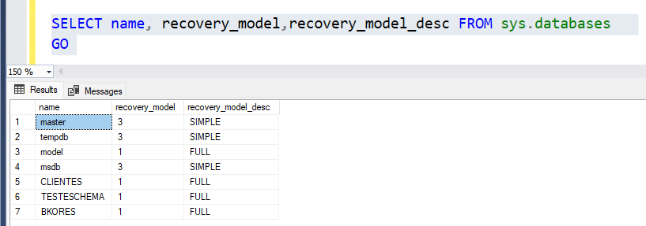 |
| Alteração do banco `BKORES` para recovery model `SIMPLE` | 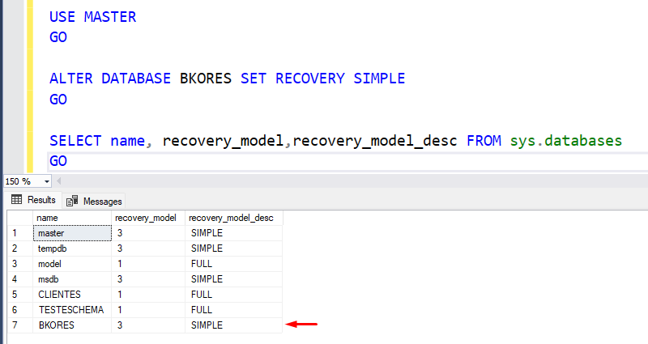 |
| Alteração do banco `BKORES` para recovery model `FULL` | 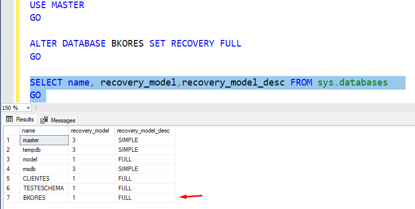 |

Nesta etapa realizei o primeiro backup Full do banco `BKORES`. O arquivo foi armazenado em um disco dedicado para backups, seguindo a boa prática de separar arquivos de backup dos arquivos de dados e logs do banco de dados.

| Etapa | Evidência |
|---|---|
| Execução do backup Full do banco `BKORES` com sucesso | 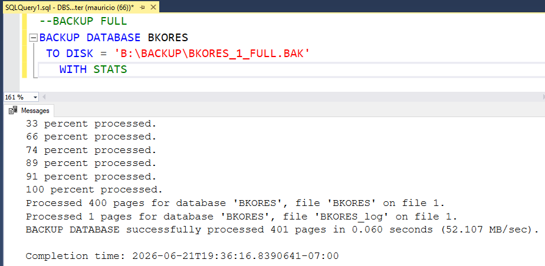 |
| Arquivo `.bak` gerado na pasta de backup | 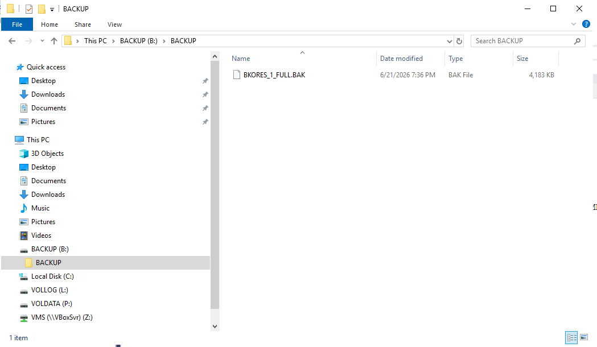 |
| Validação do banco `BKORES` disponível após o backup | 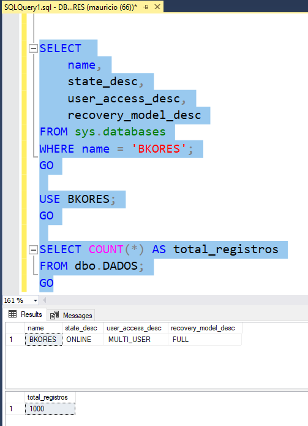 |

Nesta etapa simulei um cenário de perda do banco `BKORES`, removendo-o da instância e realizando a restauração a partir do backup Full criado anteriormente. Após o restore, foi validado que o banco voltou a ficar online e que os dados da tabela de teste foram recuperados com sucesso.

| Etapa | Evidência |
|---|---|
| Remoção do banco `BKORES` para simular perda da base | 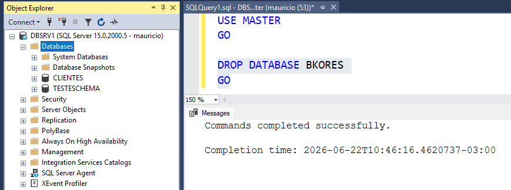 |
| Restore Full do banco `BKORES` executado com sucesso | 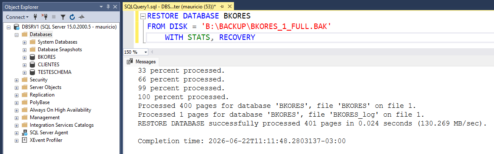 |
| Validação do banco `BKORES` online e dados recuperados após o restore | 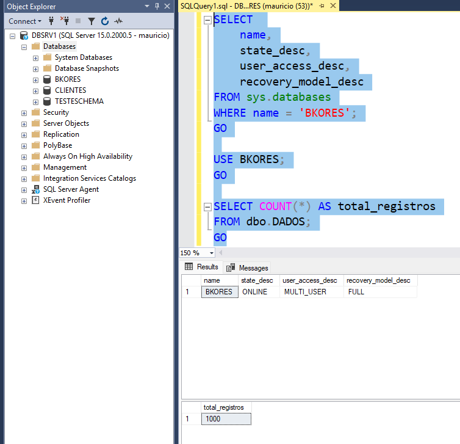 |

Nesta etapa realizei um backup Full do banco `BKORES` utilizando compressão. A prática permitiu comparar o tamanho do arquivo gerado com o backup Full anterior, demonstrando como a compressão pode reduzir o espaço utilizado para armazenamento dos backups.

IMPORTANTE: Apesar de ser uma prática positiva para economia de espaço em disco, é essencial observar que backups com compressão podem gerar maior consumo de CPU durante a execução. Por isso, em ambientes produtivos, essa configuração deve ser avaliada considerando a capacidade do servidor, o horário de execução dos backups e o impacto na carga de trabalho do banco de dados.

| Etapa | Evidência |
|---|---|
| Execução do backup Full com compressão do banco `BKORES` | 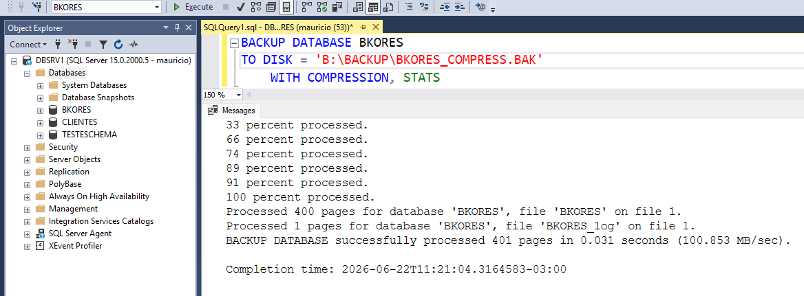 |
| Comparação entre o backup Full normal e o backup Full com compressão | 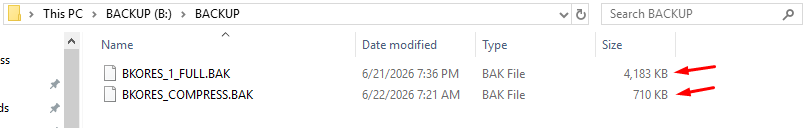 |

Nesta etapa realizei backups de log do banco `BKORES` após novas cargas de dados na tabela de teste. Os arquivos de log foram armazenados em uma pasta separada dos backups Full, facilitando a organização dos arquivos gerados durante a prática.

Em ambientes produtivos, o ideal é separar arquivos de dados, logs e backups em discos ou unidades distintas, considerando organização, desempenho e estratégia de recuperação. Para fins de estudo e prática neste laboratório, utilizei uma pasta separada para os backups de log dentro do disco dedicado a backups.

| Etapa | Evidência |
|---|---|
| Execução das cargas de dados e dos backups de log do banco `BKORES` | 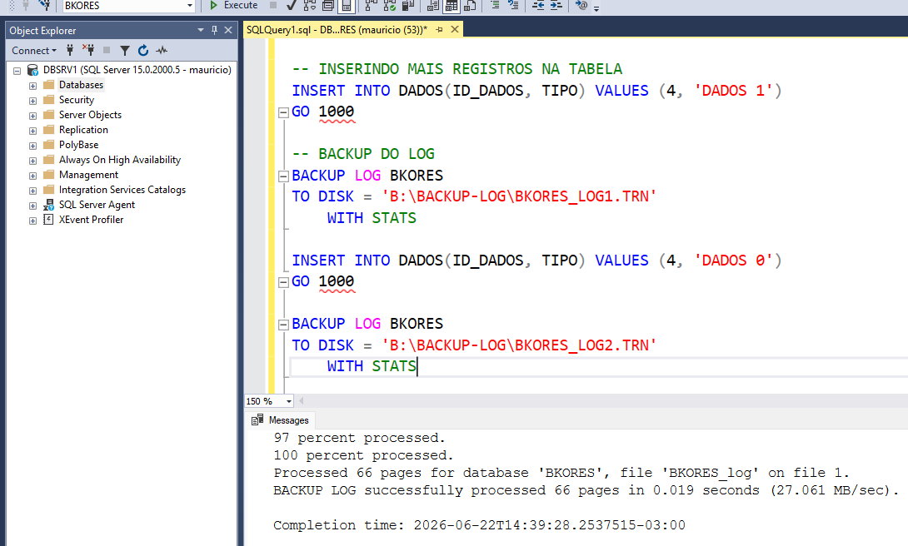 |
| Validação dos registros por carga na tabela `DADOS` | 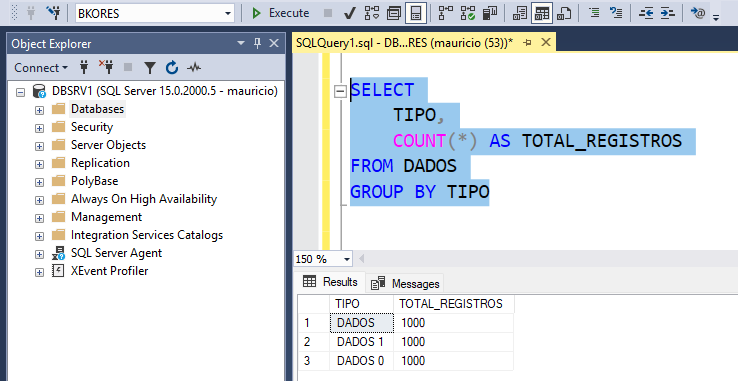 |
| Arquivos de backup de log gerados na pasta `BACKUP-LOG` | 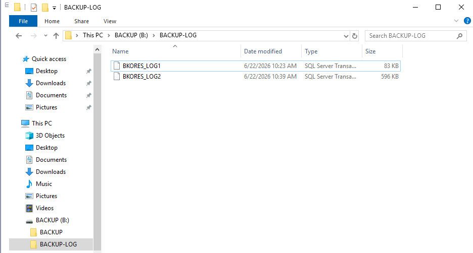 |

Nesta etapa simulei a perda do banco `BKORES` e realizei a restauração utilizando uma sequência de backups composta por um backup Full e dois backups de Log. Para isso, restaurei primeiro o backup Full com `NORECOVERY`, mantendo o banco em estado de restauração para receber os backups de log.

Em seguida, apliquei o primeiro backup de log também com `NORECOVERY` e finalizei o processo com o segundo backup de log utilizando `RECOVERY`, permitindo que o banco voltasse a ficar online. Ao final, validei os dados recuperados na tabela de teste, confirmando que as cargas realizadas após o backup Full foram restauradas corretamente.

| Etapa | Evidência |
|---|---|
| Remoção do banco `BKORES` para simular perda da base | 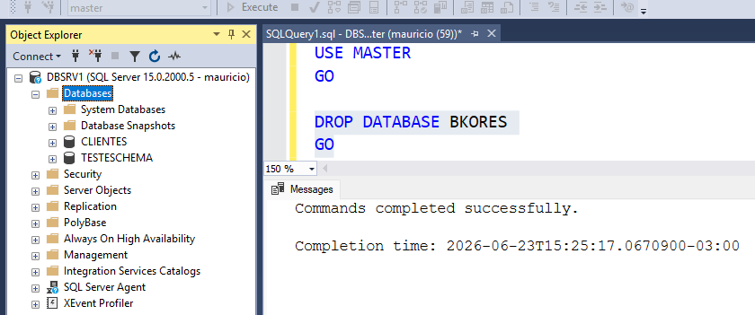 |
| Restore do backup Full com `NORECOVERY` | 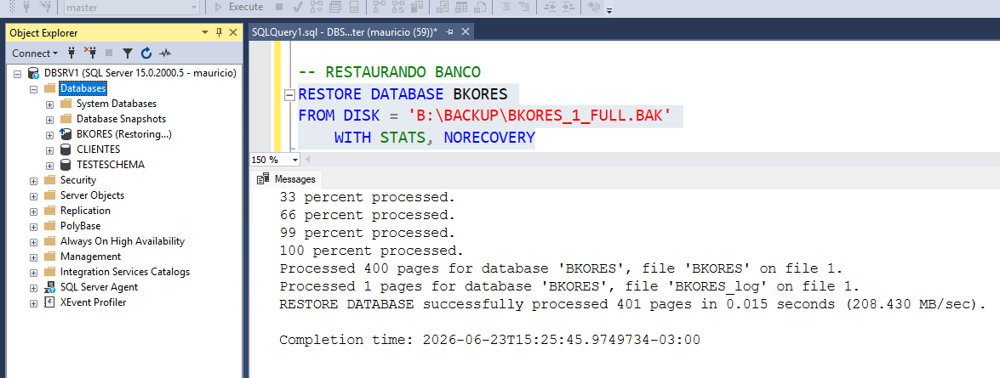 |
| Restore dos backups de Log com finalização em `RECOVERY` | 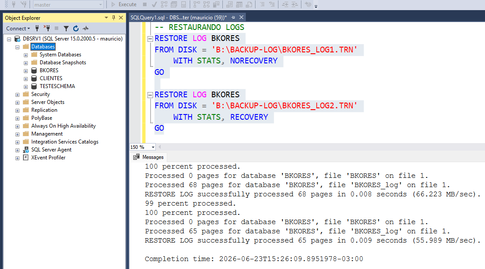 |
| Validação dos dados após restore Full + Logs | 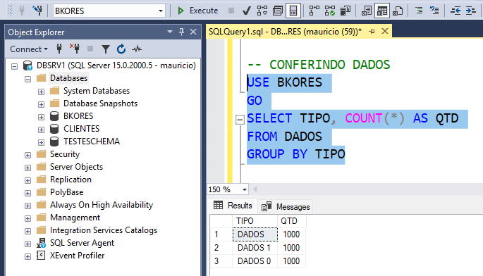 |

Nesta etapa realizei backups diferenciais do banco `BKORES` a partir de um novo backup Full usado como base. Após esse Full, inseri novas cargas de dados na tabela de teste e gerei backups diferenciais em momentos diferentes, simulando alterações progressivas no banco.

Os arquivos diferenciais foram armazenados em uma pasta separada dos backups Full e dos backups de Log, mantendo a organização dos arquivos utilizados no laboratório. Em ambientes produtivos, essa separação pode ser feita também em discos ou unidades distintas, de acordo com a estratégia de backup, retenção e recuperação definida para o ambiente.

| Etapa | Evidência |
|---|---|
| Execução do backup Full base para os backups diferenciais | 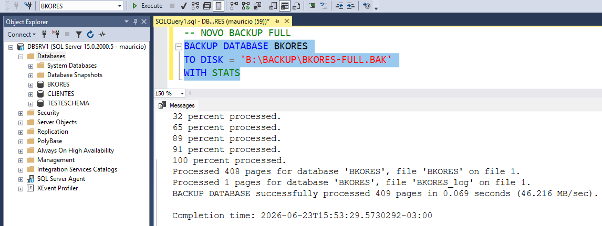 |
| Execução das cargas de dados e dos backups diferenciais do banco `BKORES` | 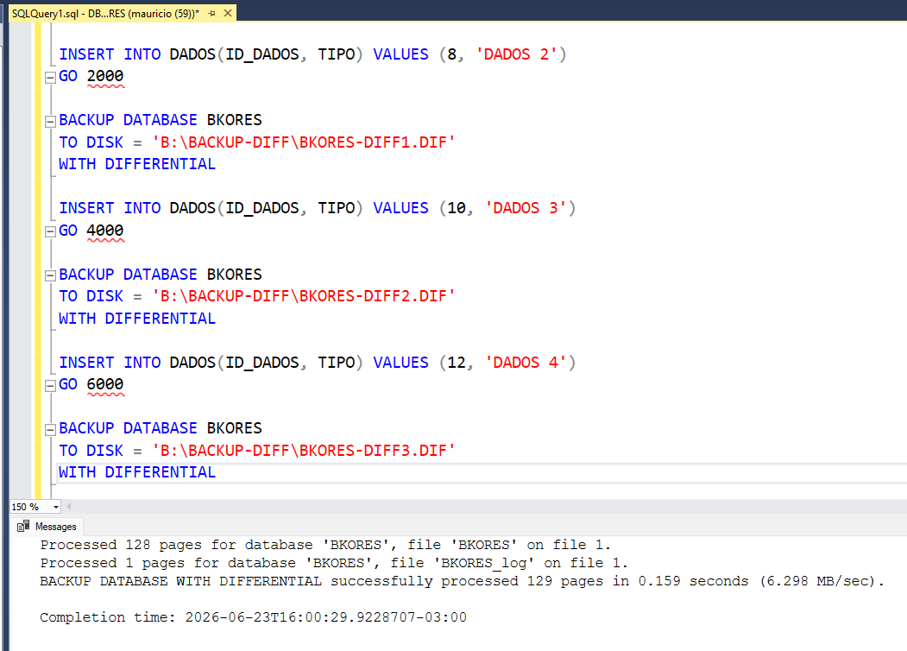 |
| Validação dos registros por carga na tabela `DADOS` | 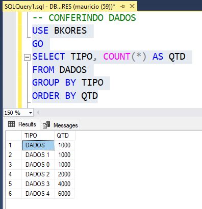 |
| Arquivos de backup diferencial gerados na pasta `BACKUP-DIFF` | 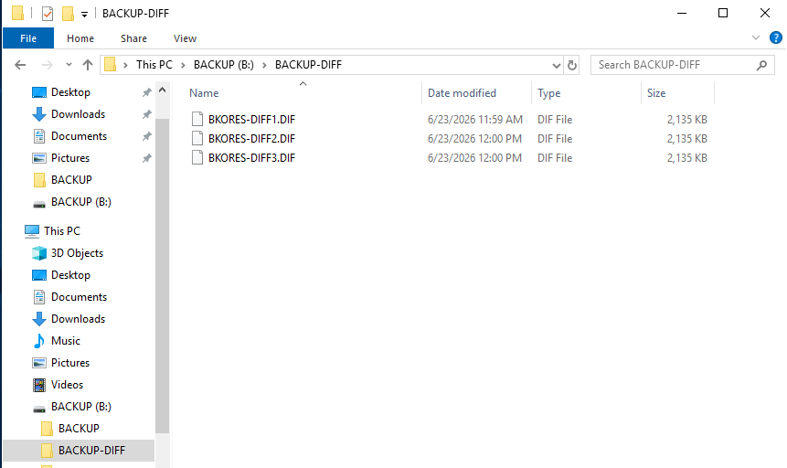 |

Nesta etapa simulei a perda do banco `BKORES` e realizei a restauração utilizando um backup Full base e o último backup Diferencial gerado. O backup Full foi restaurado com `NORECOVERY`, mantendo o banco em estado de restauração para receber o backup diferencial.

Em seguida, restaurei o último backup Diferencial com `RECOVERY`, finalizando o processo e deixando o banco online novamente. Como o backup Diferencial armazena todas as alterações realizadas desde o último backup Full, não foi necessário restaurar os diferenciais anteriores. Nesse cenário, o `BKORES-DIFF3.DIF` já continha as alterações acumuladas dos diferenciais 1 e 2.

Ao final, validei os dados da tabela de teste, confirmando que as cargas acumuladas até o último diferencial foram recuperadas com sucesso.

| Etapa | Evidência |
|---|---|
| Remoção do banco `BKORES` para simular perda da base | 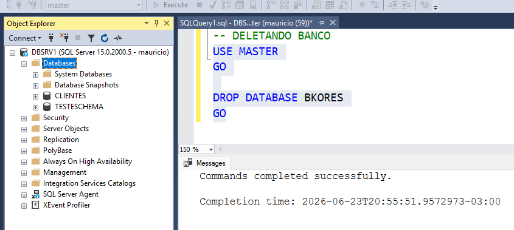 |
| Restore do backup Full base com `NORECOVERY` | 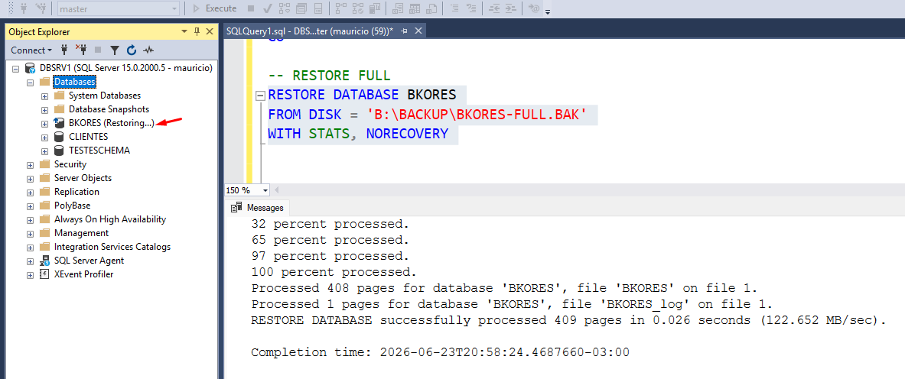 |
| Restore do último backup Diferencial com `RECOVERY` | 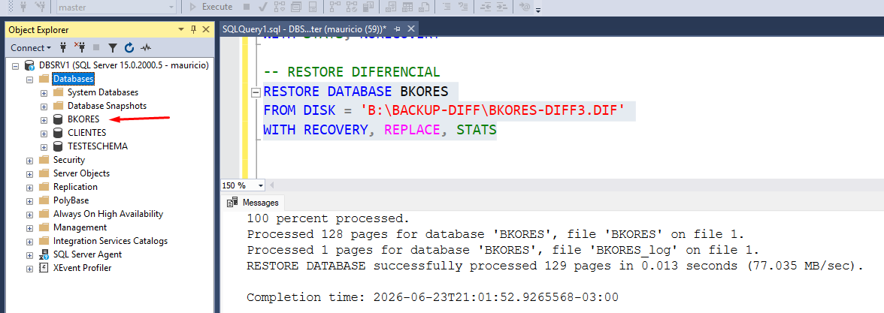 |
| Validação dos dados após restore Full + Diferencial | 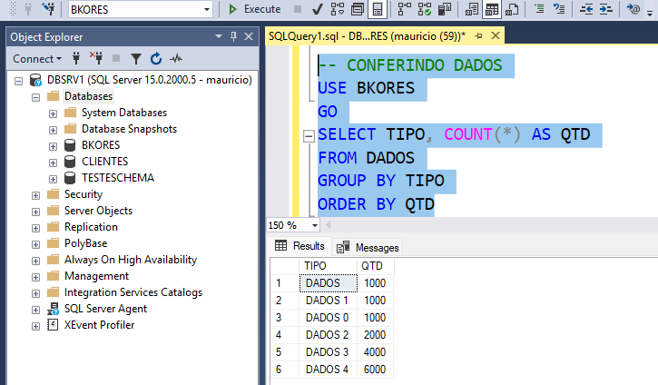 |

Nesta etapa utilizei a leitura de cabeçalho dos backups para consultar informações internas dos arquivos gerados durante as práticas. Foram verificados arquivos de backup Full, Diferencial e Log, permitindo validar informações como banco de origem, tipo de backup, datas, posição do backup no arquivo e LSNs utilizados na cadeia de recuperação.

| Etapa | Evidência |
|---|---|
| Leitura dos cabeçalhos dos backups Full, Diferencial e Log do banco `BKORES` | 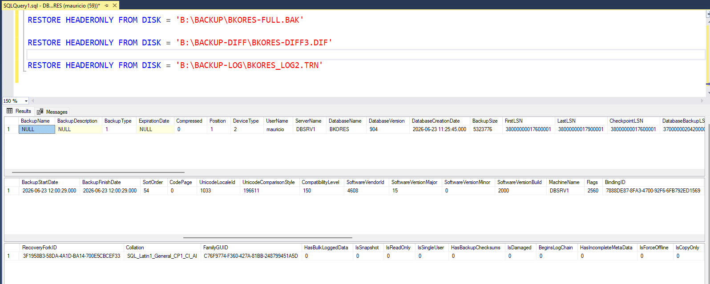 |

Nesta etapa realizei um backup Full criptografado do banco `BKORES`, utilizando uma Master Key e um certificado criados no banco `master`. Essa prática demonstra uma camada adicional de segurança para arquivos de backup, protegendo o conteúdo do `.bak` contra acesso indevido caso o arquivo seja copiado ou exposto fora da instância.

Também realizei o backup do certificado e da chave privada, pois esses arquivos são necessários para possibilitar a restauração do backup criptografado em outro ambiente ou em uma nova instância SQL Server. Sem o certificado e a chave correspondente, o arquivo de backup criptografado pode se tornar inutilizável para restore.

> Observação: a senha exibida nos prints é fictícia e foi utilizada apenas como referência visual para indicar a necessidade de uma senha forte. Durante a criação do certificado e da Master Key, foi utilizada uma senha diferente. Em ambientes reais, senhas devem ser fortes, armazenadas de forma segura e nunca expostas.

| Etapa | Evidência |
|---|---|
| Criação da Master Key utilizada para proteger o certificado | 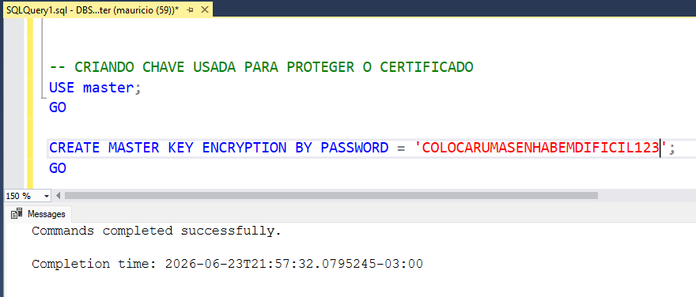 |
| Criação e validação do certificado `CERTBACKUPSQL` no banco `master` | 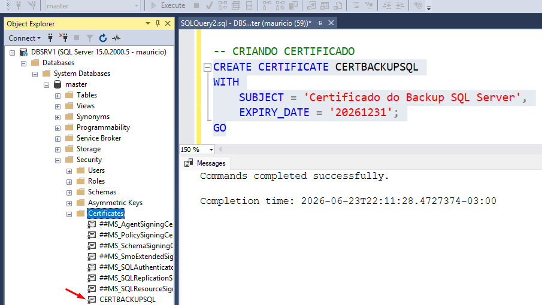 |
| Backup do certificado e da chave privada | 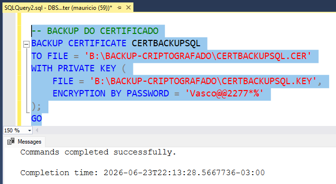 |
| Execução do backup criptografado do banco `BKORES` | 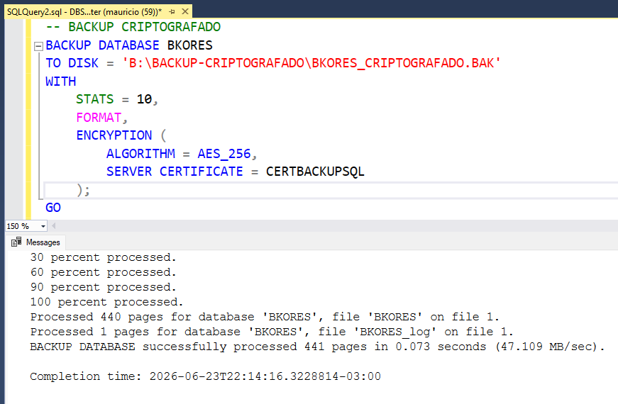 |
| Arquivos do backup criptografado, certificado e chave privada gerados | 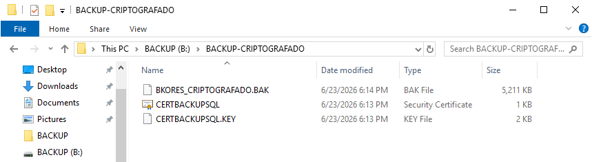 |

Ao final deste bloco, pratiquei diferentes estratégias de backup e restore no SQL Server, incluindo backups Full, Diferenciais, de Log, restaurações com `NORECOVERY` e `RECOVERY`, leitura de cabeçalho dos arquivos e backup criptografado com certificado.

As práticas reforçaram a importância de manter uma estratégia organizada de recuperação, separar arquivos de backup dos arquivos de dados e logs, validar os backups gerados e compreender a sequência correta de restauração para reduzir riscos de perda de dados em cenários de falha.
