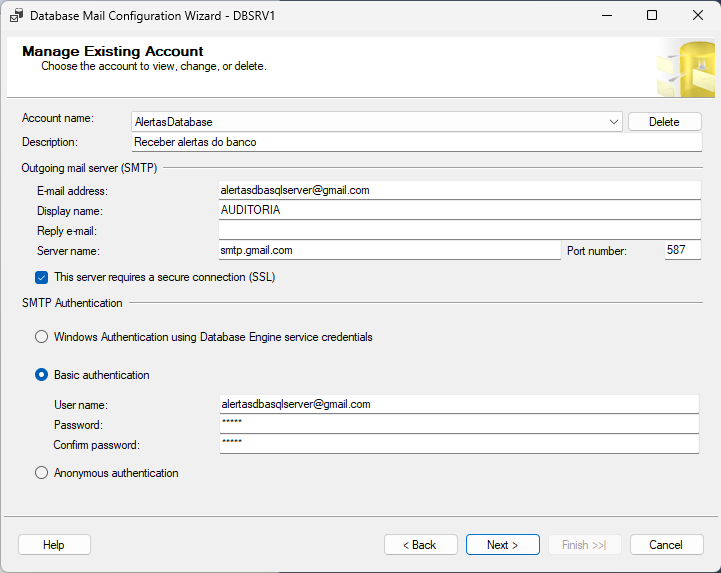
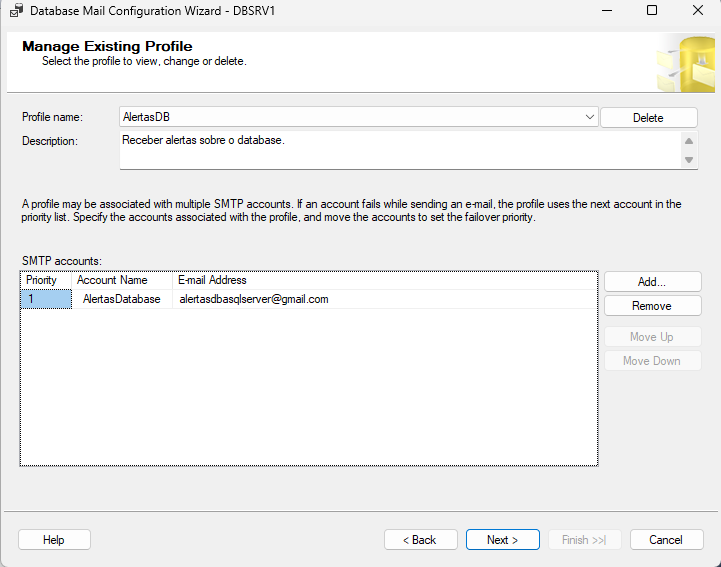
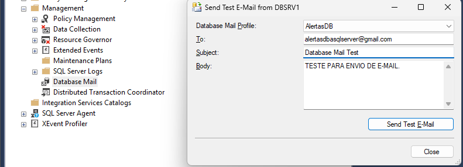
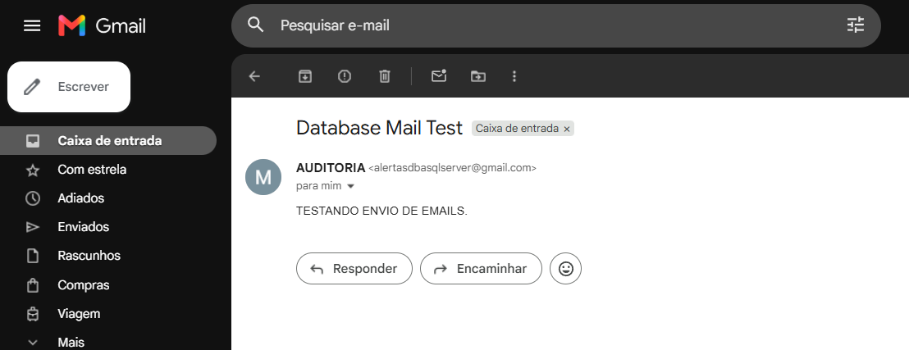
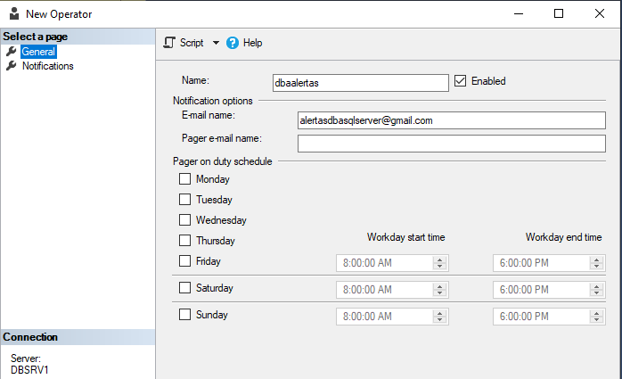
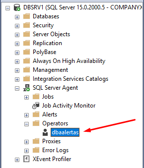
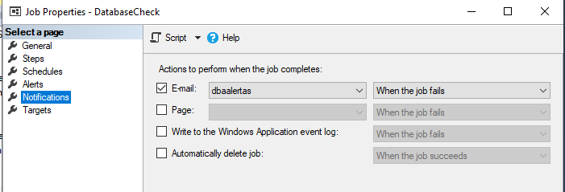
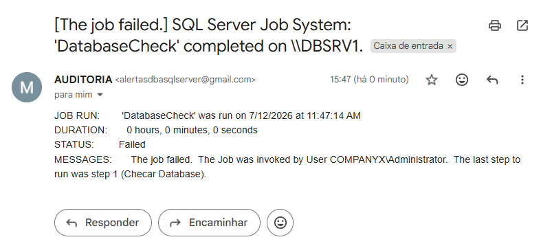

# Database Mail e Alertas

## Objetivo

Nesta etapa configurei o **Database Mail** para permitir o envio de e-mails pelo SQL Server e integrei essa funcionalidade ao **SQL Server Agent**, possibilitando o envio automático de notificações quando um Job apresentar falha.

# Configuração da conta SMTP

Configurei uma conta SMTP utilizando o serviço do Gmail para permitir o envio de notificações pelo Database Mail.

| Evidência |
|-----------|
|  |

---

## Configuração do Profile

Criei o Profile **AlertasDB** e associei a conta SMTP configurada anteriormente, permitindo sua utilização pelo SQL Server.

| Evidência |
|-----------|
|  |

---

## Teste de envio

Realizei um teste de envio utilizando o Profile configurado para validar a comunicação com o servidor SMTP.

| Evidência |
|-----------|
|  |

---

## Recebimento do e-mail de teste

Validei o funcionamento do Database Mail confirmando o recebimento do e-mail enviado durante o teste.

| Evidência |
|-----------|
|  |

---

## Criação do Operator

Criei o Operator **dbaalertas**, responsável por receber as notificações enviadas pelo SQL Server Agent.

| Evidência |
|-----------|
|  |

---

## Operator criado

Após a criação, confirmei que o Operator estava disponível para utilização pelo SQL Server Agent.

| Evidência |
|-----------|
|  |

---

## Configuração da notificação do Job

Configurei o Job **DatabaseCheck** para enviar notificações por e-mail ao Operator sempre que ocorrer uma falha durante sua execução.

| Evidência |
|-----------|
|  |

---

## Validação da notificação de falha

Para validar a configuração, provoquei uma falha controlada durante a execução do Job **DatabaseCheck** e confirmei o recebimento automático da notificação por e-mail, comprovando a integração entre SQL Server Agent, Operator e Database Mail.

| Evidência |
|-----------|
|  |

---

# Boas práticas

Durante esta prática apliquei algumas boas práticas utilizadas na administração do SQL Server:

- Utilizar um Profile dedicado para envio de notificações administrativas;
- Centralizar o recebimento de alertas por meio de Operators;
- Configurar notificações automáticas para Jobs críticos;
- Validar a configuração realizando testes de envio antes da utilização em produção;
- Executar testes de falha controlada para garantir que as notificações estejam funcionando corretamente;
- Priorizar notificações em caso de falha para reduzir o volume de e-mails enviados pelo ambiente.
