# Maintenance Plans

## Objetivo

Nesta etapa criei o plano de manutenção **RotinasBackup** para automatizar a verificação de integridade dos bancos de dados e a execução dos backups Full, Diferencial e de Log por meio do SQL Server Agent.

---

## Propriedades do plano

Configurei o plano para utilizar a conta de serviço do SQL Server Agent e defini agendamentos separados para cada tarefa.

| Evidência |
|-----------|
| 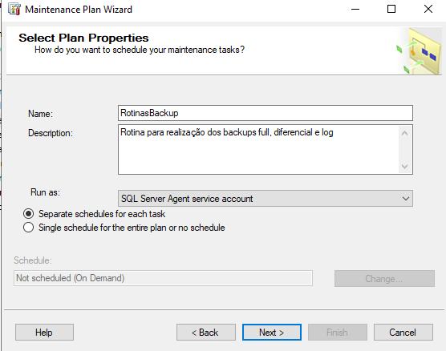 |

---

## Ordem das tarefas

Adicionei ao plano as tarefas de verificação de integridade, Backup Full, Backup Diferencial e Backup de Log.

| Evidência |
|-----------|
| 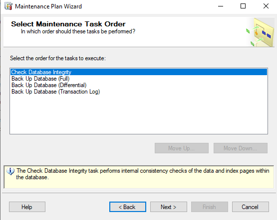 |

---

## Verificação de integridade

Configurei a verificação de integridade para todos os bancos de dados, incluindo índices e utilizando a opção **Physical Only**.

| Configuração | Agendamento |
|---|---|
| 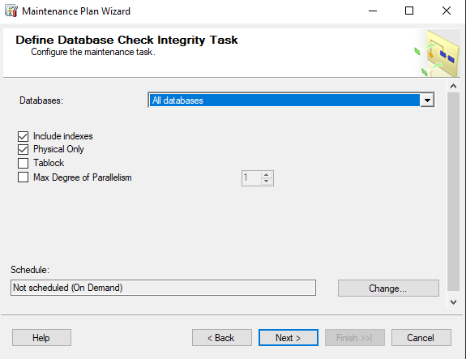 | 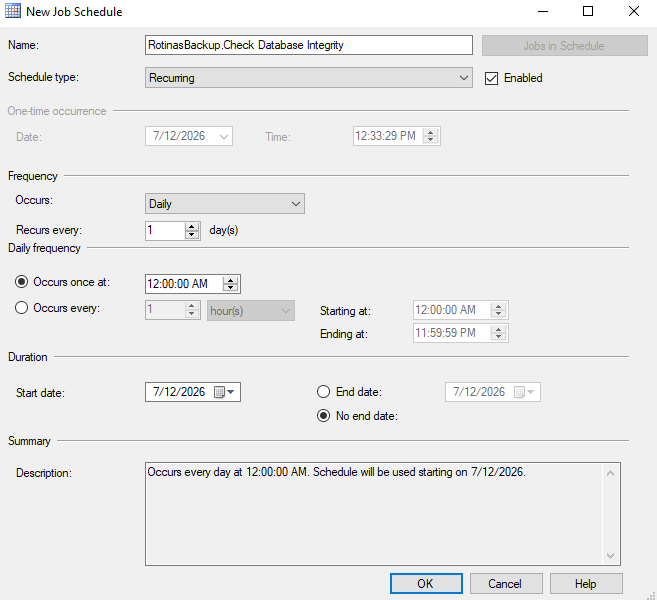 |

A tarefa foi agendada para execução diária à meia-noite.

---

## Backup Full

Configurei o Backup Full para as bases selecionadas, com criação de um arquivo separado para cada banco de dados no diretório `P:\Backup`.

Também habilitei a verificação de integridade do backup e a utilização de checksum.

| Bases selecionadas | Destino |
|---|---|
| 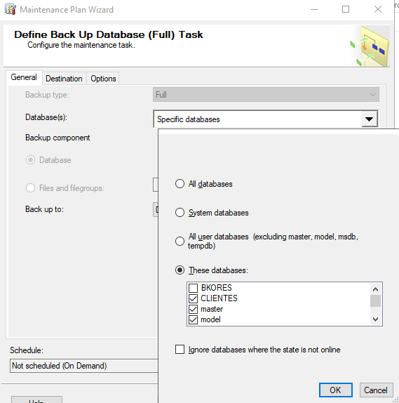 | 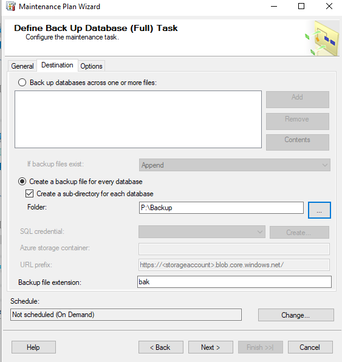 |

| Opções | Agendamento |
|---|---|
| 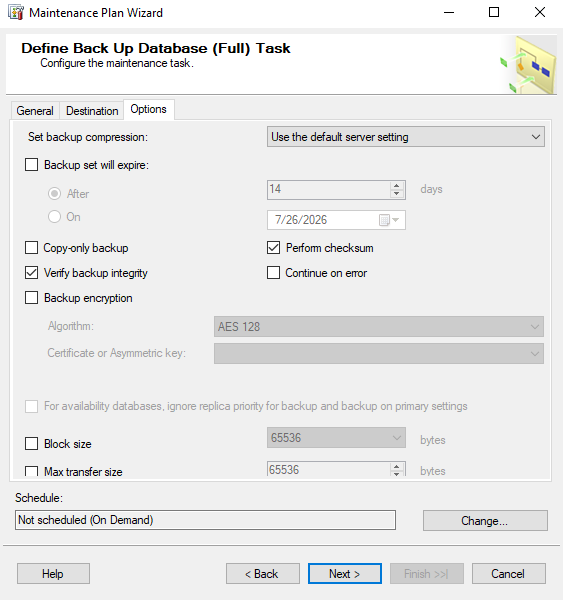 | 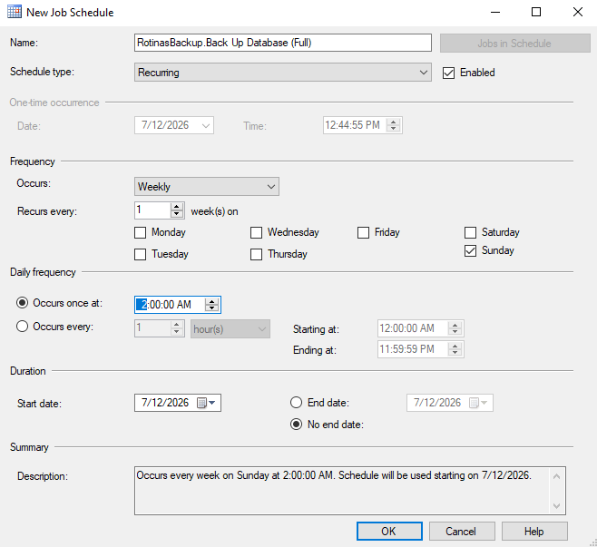 |

O Backup Full foi agendado para execução semanal aos domingos, às 02:00.

---

## Backup Diferencial

Configurei o Backup Diferencial para as bases selecionadas, utilizando o mesmo diretório e mantendo um arquivo separado para cada banco de dados.

Também habilitei a verificação de integridade e a utilização de checksum.

| Bases selecionadas | Destino |
|---|---|
| 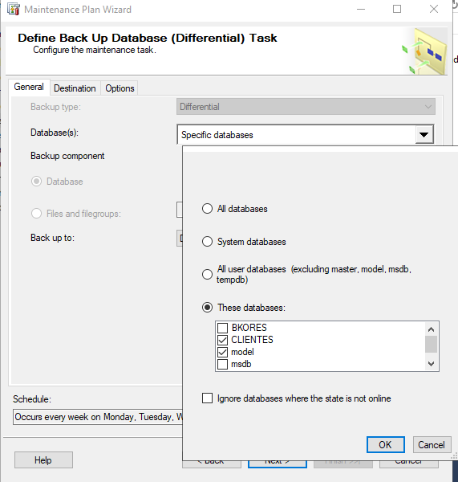 | 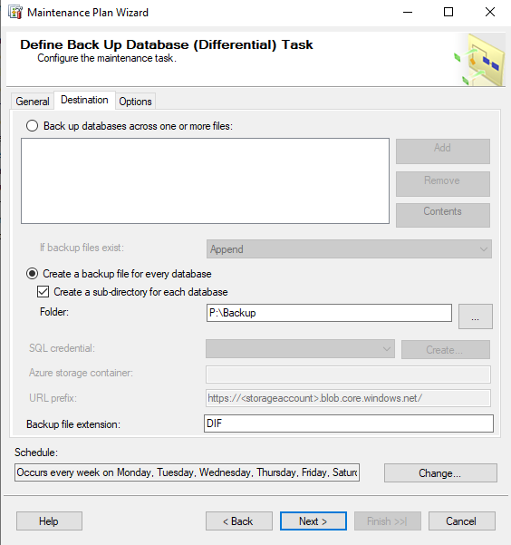 |

| Opções | Agendamento |
|---|---|
| 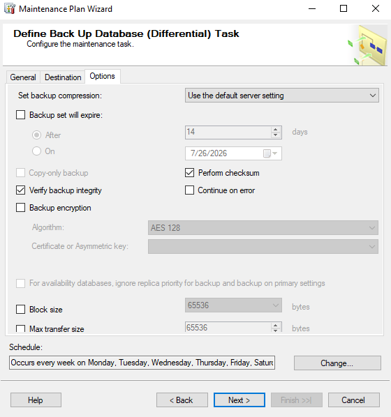 | 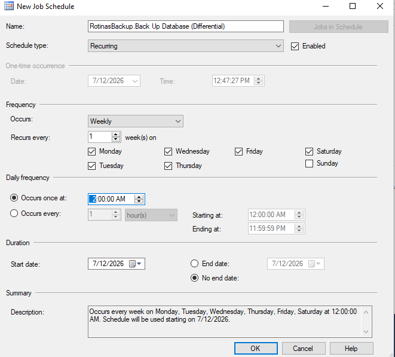 |

O Backup Diferencial foi agendado de segunda-feira a sábado, às 02:00.

---

## Backup de Log

Configurei o Backup de Log para as bases selecionadas que utilizam um Recovery Model compatível com esse tipo de backup.

Os arquivos foram direcionados para `P:\Backup`, com verificação de integridade e checksum habilitados.

| Bases selecionadas | Destino |
|---|---|
| 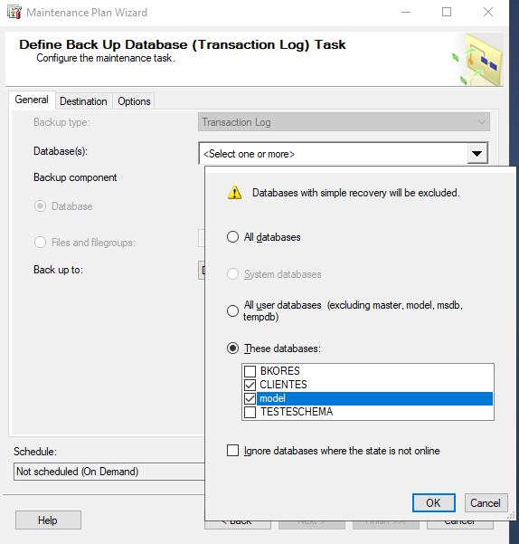 | 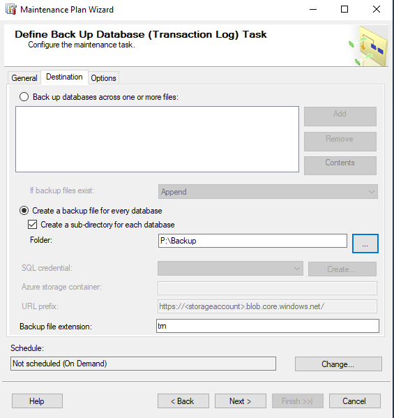 |

| Opções | Agendamento |
|---|---|
| 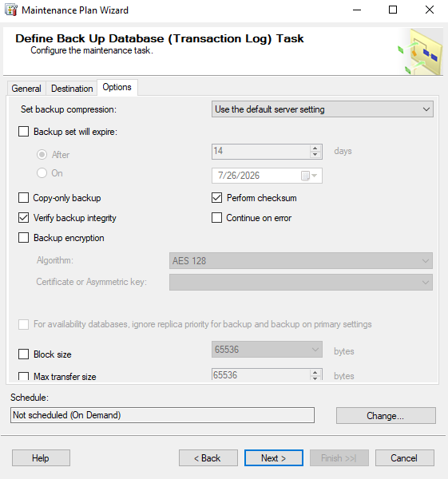 | 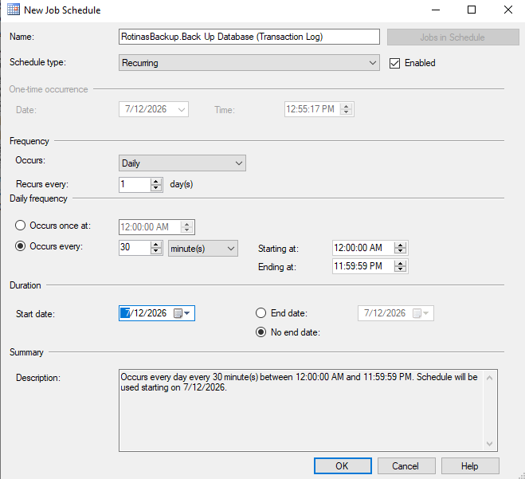 |

O Backup de Log foi agendado para execução diária a cada 30 minutos.

---

## Criação do plano

Concluí a criação do plano **RotinasBackup** e validei que todas as etapas do assistente foram executadas com sucesso.

| Evidência |
|-----------|
| 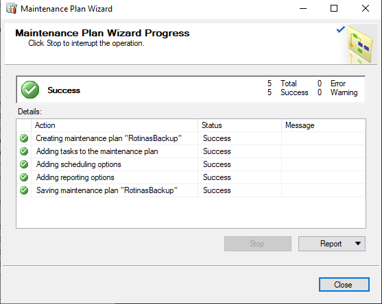 |

---

## Jobs gerados

Após a criação do plano, confirmei que o SQL Server Agent gerou os Jobs responsáveis pelas tarefas de integridade e backup.

| Evidência |
|-----------|
| 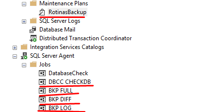 |

---

## Execução das rotinas

Executei manualmente os Jobs criados para validar as configurações e confirmei que todas as rotinas foram concluídas com sucesso.

| Evidência |
|-----------|
| 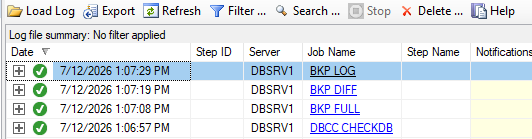 |

---

## Estrutura dos backups

Configurei a criação automática de uma subpasta para cada banco de dados no diretório de backup.

| Evidência |
|-----------|
| 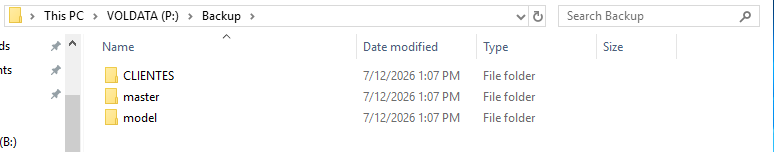 |

---

## Arquivos gerados

Após a execução das rotinas, confirmei a geração dos arquivos de Backup Full, Diferencial e de Log.

| Evidência |
|-----------|
| 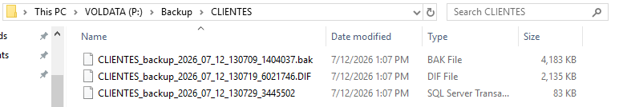 |

---

# Boas práticas

Durante esta prática:

- Utilizei agendamentos separados para cada tarefa do plano;
- Organizei os arquivos em subpastas específicas para cada banco de dados;
- Habilitei checksum e verificação de integridade nos backups;
- Combinei backups Full, Diferenciais e de Log;
- Validei manualmente os Jobs antes de depender dos agendamentos automáticos;
- Confirmei a criação dos arquivos no diretório configurado.
