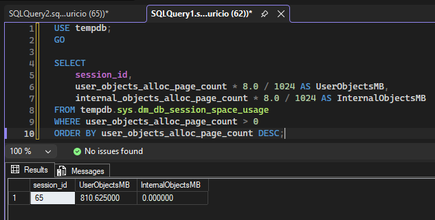
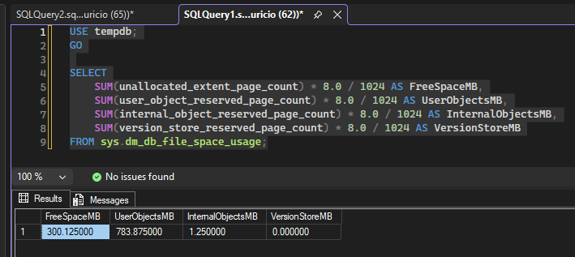

# Monitoramento do TempDB

## Cenário

Realizei um laboratório prático de monitoramento e troubleshooting do TempDB, simulando um cenário de crescimento, identificando a sessão responsável pelo consumo e realizando o tratamento do incidente.

Para isso, simulei um crescimento controlado do TempDB através da criação e preenchimento de uma tabela temporária.

O laboratório me permitiu acompanhar o ciclo completo de um incidente:

**Crescimento → Alerta → Investigação → Tratamento → Validação**

## Estado inicial

Antes de iniciar a simulação, analisei o tamanho dos arquivos e a utilização do TempDB.

### Evidência

## Simulação de crescimento

Criei e preenchi uma tabela temporária com grande volume de dados para provocar o crescimento controlado do TempDB.

### Evidência

## Alerta

Após o crescimento do TempDB, recebi o alerta informando que a utilização dos arquivos MDF havia ultrapassado o limite configurado.

### Evidência

## Investigação

Após receber o alerta, identifiquei a sessão responsável pelo consumo de espaço no TempDB.

Analisei as informações da sessão e consultei o último comando executado para confirmar a origem do consumo.

### Evidência

Também analisei a utilização do TempDB durante o incidente para verificar o impacto do consumo.

### Evidência

## Tratamento

Como o consumo foi provocado pela minha própria sessão de laboratório, removi a tabela temporária utilizada no teste, liberando o espaço ocupado no TempDB.

### Evidência

## Validação

Após o tratamento, verifiquei o tamanho físico dos arquivos e confirmei que eles permaneceram com o tamanho adquirido durante o crescimento.

### Evidência

## Alerta CLEAR

Após a normalização da utilização, executei novamente o alerta para validar a recuperação do ambiente e recebi a mensagem de **CLEAR**, confirmando que a condição do alerta havia sido normalizada.

### Evidência

## Boas práticas

- Monitorar o crescimento e a utilização do TempDB.
- Investigar a sessão responsável antes de realizar qualquer intervenção.
- Evitar `KILL` ou redução dos arquivos sem compreender a causa do consumo.
- Não realizar shrink do TempDB automaticamente após todo crescimento.
- Dimensionar o TempDB de acordo com a carga esperada do ambiente.
