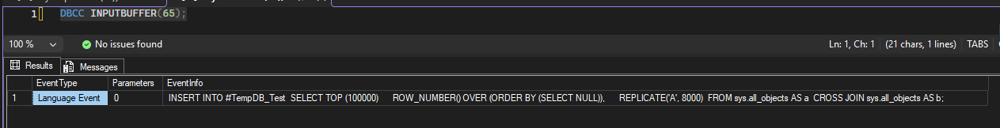

# Lab 1

## Cenário

Realizei um laboratório prático de monitoramento e troubleshooting do TempDB, simulando um cenário de crescimento, identificando a sessão responsável pelo consumo e realizando o tratamento do incidente.

Para isso, simulei um crescimento controlado do TempDB através da criação e preenchimento de uma tabela temporária.

O laboratório me permitiu acompanhar o ciclo completo de um incidente:

**Crescimento → Alerta → Investigação → Tratamento → Validação**

## Estado inicial

Antes de iniciar a simulação, analisei o tamanho dos arquivos e a utilização do TempDB.

### Evidência


## Simulação de crescimento

Criei e preenchi uma tabela temporária com grande volume de dados para provocar o crescimento controlado do TempDB.

### Evidência


## Alerta

Após o crescimento do TempDB, recebi o alerta informando que a utilização dos arquivos MDF havia ultrapassado o limite configurado.

### Evidência


## Investigação

Após receber o alerta, identifiquei a sessão responsável pelo consumo de espaço no TempDB.

A sessão identificada foi a **65**, pertencente à minha conexão no SSMS.

### Evidência


Também analisei a utilização do TempDB durante o incidente para verificar o impacto do consumo.

### Evidência


Para confirmar a operação executada pela sessão 65, utilizei o `DBCC INPUTBUFFER`, que apresentou o `INSERT` responsável pelo preenchimento da tabela temporária.

### Evidência



## Tratamento

Como o consumo foi provocado pela minha própria sessão de laboratório, removi a tabela temporária utilizada no teste, liberando o espaço ocupado no TempDB.

### Evidência


## Validação

Após o tratamento, verifiquei o tamanho físico dos arquivos e confirmei que eles permaneceram com o tamanho adquirido durante o crescimento.

### Evidência


## Alerta CLEAR

Após a normalização da utilização, executei novamente o alerta para validar a recuperação do ambiente e recebi a mensagem de **CLEAR**, confirmando que a condição do alerta havia sido normalizada.

### Evidência


## Boas práticas

- Monitorar o crescimento e a utilização do TempDB.
- Investigar a sessão responsável antes de realizar qualquer intervenção.
- Evitar `KILL` ou redução dos arquivos sem compreender a causa do consumo.
- Não realizar shrink do TempDB automaticamente após todo crescimento.
- Dimensionar o TempDB de acordo com a carga esperada do ambiente.

## Lab 2 — Investigação de crescimento e troubleshooting

### Cenário

Neste segundo laboratório, simulei um cenário em que uma sessão provoca o crescimento natural do TempDB durante uma operação controlada.

O objetivo foi acompanhar o crescimento dos arquivos, identificar a sessão responsável pelo consumo, realizar o tratamento da sessão e analisar o comportamento do TempDB após a liberação do espaço.

### Configuração inicial

Para este laboratório, os oito arquivos de dados do TempDB foram configurados com 1 GB cada, utilizando crescimento automático de 64 MB.

O alerta `Tempdb MDF File Utilization` permaneceu habilitado, com limite de utilização de 70% e tamanho mínimo de arquivo de 100 MB.


### Crescimento natural

Criei uma tabela temporária e iniciei uma transação com inserções sucessivas, permitindo que o TempDB consumisse o espaço disponível e realizasse o crescimento automático dos arquivos conforme a necessidade.

A evolução do crescimento foi acompanhada utilizando uma consulta baseada no material de Fabrício Lima.


No último registro, os arquivos de dados atingiram aproximadamente 1,08 GB, demonstrando o autogrowth natural de 64 MB.

### Identificação da sessão

Utilizei o `sp_whoisactive` para identificar a sessão responsável pelo consumo do TempDB.

A sessão identificada apresentava consumo de TempDB e uma transação aberta, permitindo relacionar a atividade ao crescimento observado.


### Tratamento da sessão

Após identificar a sessão responsável pelo consumo, utilizei o comando `KILL` para encerrá-la no ambiente de laboratório.


### Liberação do espaço

Após o encerramento da sessão, consultei novamente a utilização do TempDB.

O resultado demonstrou que o espaço utilizado pela sessão foi liberado.


### Tamanho físico dos arquivos

Mesmo após a liberação do espaço utilizado, os arquivos de dados permaneceram fisicamente maiores que o tamanho inicial.

Os arquivos estavam em aproximadamente 1,28 GB, enquanto o espaço utilizado internamente já havia sido liberado.


Esse comportamento demonstra a diferença entre liberar espaço dentro do arquivo e reduzir fisicamente o tamanho do arquivo.

### SHRINKFILE

Como parte do experimento, utilizei o `DBCC SHRINKFILE` no arquivo `tempdev`, com o objetivo de reduzi-lo novamente para 1 GB.

```sql
DBCC SHRINKFILE
(
    tempdev,
    1024
);
