# Lab 1

## Cenário

Realizei um laboratório prático de monitoramento e troubleshooting do TempDB, simulando um cenário de crescimento, identificando a sessão responsável pelo consumo e realizando o tratamento do incidente.

Para isso, simulei um crescimento controlado do TempDB através da criação e preenchimento de uma tabela temporária.

O laboratório me permitiu acompanhar o ciclo completo de um incidente:

**Crescimento → Alerta → Investigação → Tratamento → Validação**

## Estado inicial

Antes de iniciar a simulação, analisei o tamanho dos arquivos e a utilização do TempDB.

### Evidência

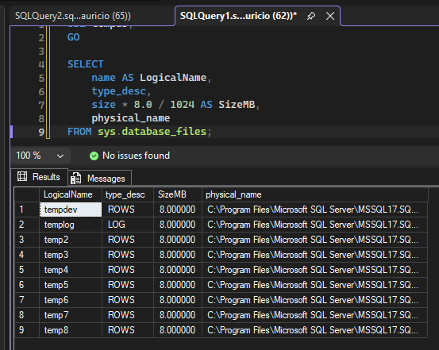

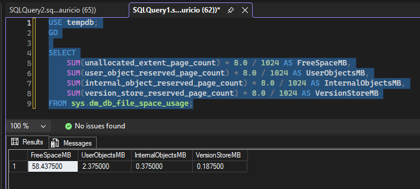

## Simulação de crescimento

Criei e preenchi uma tabela temporária com grande volume de dados para provocar o crescimento controlado do TempDB.

### Evidência

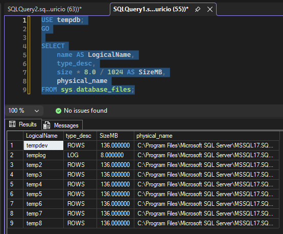

## Alerta

Após o crescimento do TempDB, recebi o alerta informando que a utilização dos arquivos MDF havia ultrapassado o limite configurado.

### Evidência

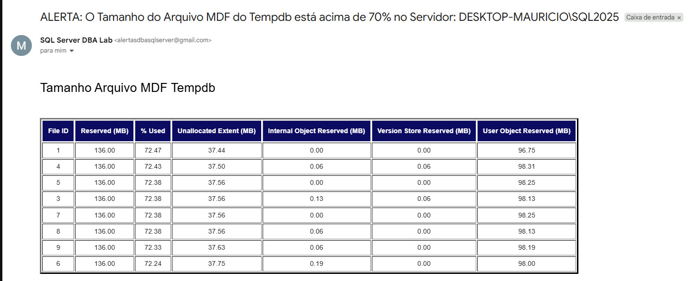

## Investigação

Após receber o alerta, identifiquei a sessão responsável pelo consumo de espaço no TempDB.

A sessão identificada foi a **65**, pertencente à minha conexão no SSMS.

### Evidência


Também analisei a utilização do TempDB durante o incidente para verificar o impacto do consumo.

### Evidência


Para confirmar a operação executada pela sessão 65, utilizei o `DBCC INPUTBUFFER`, que apresentou o `INSERT` responsável pelo preenchimento da tabela temporária.

### Evidência


## Tratamento

Como o consumo foi provocado pela minha própria sessão de laboratório, removi a tabela temporária utilizada no teste, liberando o espaço ocupado no TempDB.

### Evidência

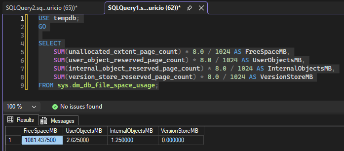

## Validação

Após o tratamento, verifiquei o tamanho físico dos arquivos e confirmei que eles permaneceram com o tamanho adquirido durante o crescimento.

### Evidência

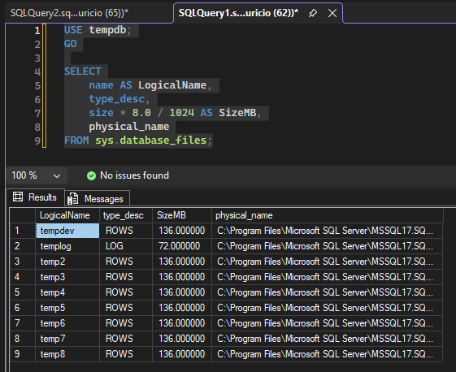

## Alerta CLEAR

Após a normalização da utilização, executei novamente o alerta para validar a recuperação do ambiente e recebi a mensagem de **CLEAR**, confirmando que a condição do alerta havia sido normalizada.

### Evidência

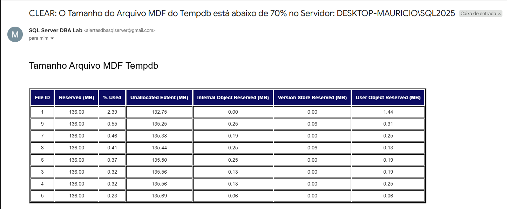

## Boas práticas

- Monitorar o crescimento e a utilização do TempDB.
- Investigar a sessão responsável antes de realizar qualquer intervenção.
- Evitar `KILL` ou redução dos arquivos sem compreender a causa do consumo.
- Não realizar shrink do TempDB automaticamente após todo crescimento.
- Dimensionar o TempDB de acordo com a carga esperada do ambiente.

---

# Lab 2

## Cenário

Neste segundo laboratório, realizei um cenário em que uma sessão provocou o crescimento natural do TempDB durante uma operação controlada.

O objetivo foi acompanhar o crescimento dos arquivos, identificar a sessão responsável pelo consumo, realizar o tratamento da sessão e analisar o comportamento do TempDB após a liberação do espaço.

### Configuração inicial

Para este laboratório, os oito arquivos de dados do TempDB estavam configurados com 1 GB cada.

O crescimento automático dos arquivos estava configurado em 64 MB.

O alerta `Tempdb MDF File Utilization` permaneceu habilitado, com limite de utilização de 70% e tamanho mínimo de arquivo de 100 MB.

### Evidência

.png)

### Crescimento natural

Criei uma tabela temporária e iniciei uma transação com inserções sucessivas.

A carga foi mantida em execução para permitir o acompanhamento do consumo do TempDB e do crescimento automático dos arquivos.

Para acompanhar a evolução, utilizei uma consulta baseada no material de Fabrício Lima.

### Evidências

.png)

.png)

.png)

.png)

Durante o processo, acompanhei a evolução da utilização dos arquivos e o crescimento automático conforme a necessidade da carga.

Ao final da carga, os arquivos de dados haviam aumentado de tamanho em relação à configuração inicial.

### Identificação da sessão

Utilizei o `sp_whoisactive` para identificar a sessão responsável pelo consumo do TempDB.

A sessão identificada apresentava consumo de TempDB e uma transação aberta, permitindo relacionar a atividade ao crescimento observado.

### Evidência

.png)

### Tratamento da sessão

Após identificar a sessão responsável pelo consumo, utilizei o comando `KILL` para encerrá-la no ambiente de laboratório.

```sql
KILL <session_id>;
```

### Evidência

.png)

### Liberação do espaço

Após o encerramento da sessão, consultei novamente a utilização do TempDB.

O resultado demonstrou que o espaço utilizado pela sessão foi liberado.

### Evidência

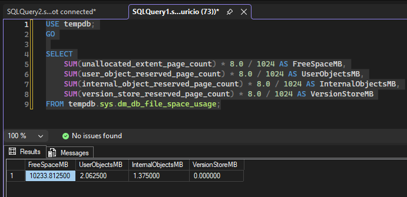

### Tamanho físico dos arquivos

Mesmo após a liberação do espaço interno, os arquivos de dados permaneceram fisicamente maiores que o tamanho inicial.

Os arquivos de dados estavam em aproximadamente 1,28 GB.

### Evidência

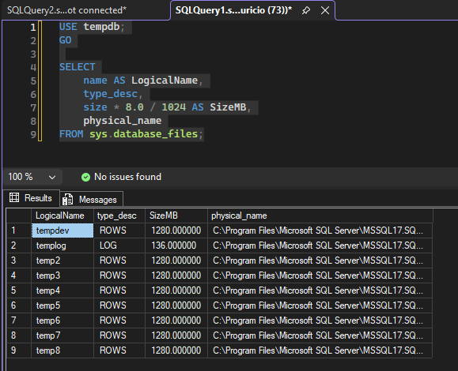

Esse comportamento demonstra a diferença entre liberar espaço dentro do arquivo e reduzir fisicamente o tamanho do arquivo.

### SHRINKFILE

Como parte do experimento, utilizei o `DBCC SHRINKFILE` no arquivo `tempdev`, com o objetivo de demonstrar a redução física de um arquivo após a liberação do espaço utilizado.

```sql
USE tempdb;
GO

DBCC SHRINKFILE
(
    tempdev,
    1024
);
GO
```

O arquivo `tempdev` foi reduzido de aproximadamente 1,28 GB para 1 GB.

### Evidência

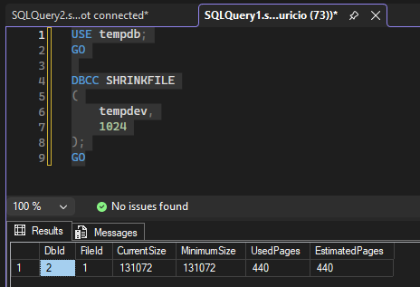

Após a execução, validei novamente o tamanho físico dos arquivos.

### Evidência

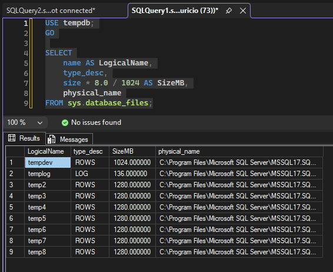

### Restart do SQL Server

Por fim, reiniciei a instância do SQL Server para observar o comportamento do TempDB após sua recriação.

### Evidência

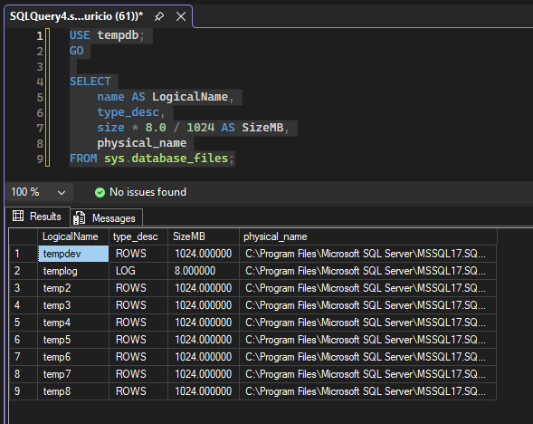

Após o restart, os arquivos de dados foram recriados com 1 GB cada.

Também validei novamente a utilização do TempDB.

### Evidência

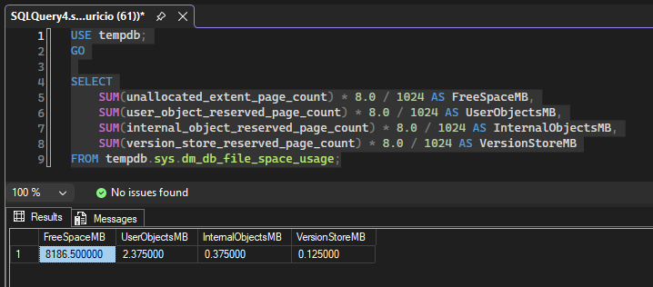

### Observações

As operações de `KILL`, `SHRINKFILE` e restart foram realizadas exclusivamente em ambiente de laboratório, com o objetivo de compreender o comportamento do TempDB durante cenários controlados.

O `KILL` deve ser utilizado somente após a investigação da sessão e avaliação do impacto de seu encerramento. Em ambiente produtivo, o encerramento de uma sessão pode provocar rollback e impactos para a aplicação.

O `SHRINKFILE` não deve ser utilizado como rotina de manutenção para tratar o crescimento recorrente do TempDB. Antes de considerar um shrink, é necessário investigar a causa do crescimento e avaliar se o tamanho atual é necessário para a carga de trabalho.

O fato de o `SHRINKFILE` ter funcionado neste laboratório não significa que ele seja apropriado para todos os cenários ou que sempre conseguirá reduzir o arquivo até o tamanho desejado.

Da mesma forma, o restart do SQL Server não deve ser utilizado como mecanismo de tratamento de incidentes relacionados ao crescimento do TempDB em ambiente produtivo, pois provoca indisponibilidade da instância e das aplicações dependentes dela.

Neste laboratório, essas operações foram utilizadas exclusivamente para demonstrar tecnicamente a diferença entre consumo de espaço, liberação de espaço, crescimento automático e redução física dos arquivos.
