# Performance & Tuning

## Objetivo

Neste módulo, realizei uma prática de **Index Tuning** no SQL Server, analisando o comportamento de uma consulta antes e depois da criação de um índice.

Utilizei o banco de dados `StackOverflow2010` e a tabela `dbo.Badges`, que possui aproximadamente 1,1 milhão de registros.

Durante a prática, utilizei o **SQL Server Management Studio (SSMS)**, análise de índices, plano de execução e `SET STATISTICS IO` para comparar o desempenho da consulta antes e depois da otimização.

---

## Etapa 1 - Validação dos índices existentes

Antes de criar um novo índice, comecei verificando os índices que já existiam na tabela `dbo.Badges`. Para essa verificação, basta selecionar o nome da tabela e pressionar **ALT + F1**.

Essa etapa me permitiu verificar quais índices já estavam disponíveis antes de realizar qualquer alteração na tabela.

### Evidência

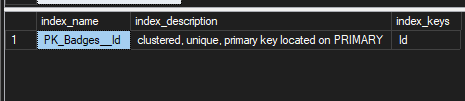

A imagem apresenta a **validação dos índices existentes atualmente na tabela `dbo.Badges`**.

---

## Etapa 2 - Análise da consulta

Depois da validação dos índices existentes, montei uma consulta utilizando filtros nas colunas `Name`, `Date` e `UserId`.

Analisei as condições utilizadas no `WHERE` para entender quais colunas poderiam contribuir para melhorar a filtragem dos registros.

Também realizei uma análise da quantidade de registros retornados pelos filtros para auxiliar na escolha da ordem das colunas do índice.

---

## Etapa 3 - Execução inicial

Antes de criar o índice, executei a consulta e analisei o plano de execução e as estatísticas de I/O.

O plano de execução apresentou um **Clustered Index Scan**.

Nesse cenário, a consulta realizou **6.547 páginas lidas**.

Utilizei esse resultado como referência para comparar o desempenho após a criação do índice.

### Evidências

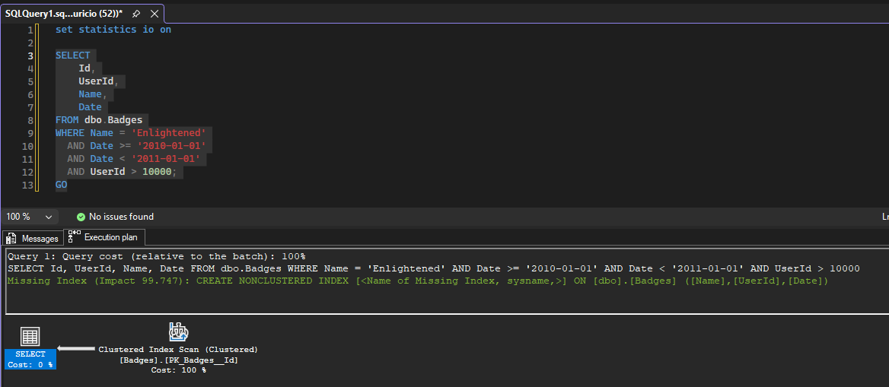

A imagem apresenta o **plano de execução estimado da consulta antes da criação do índice**.

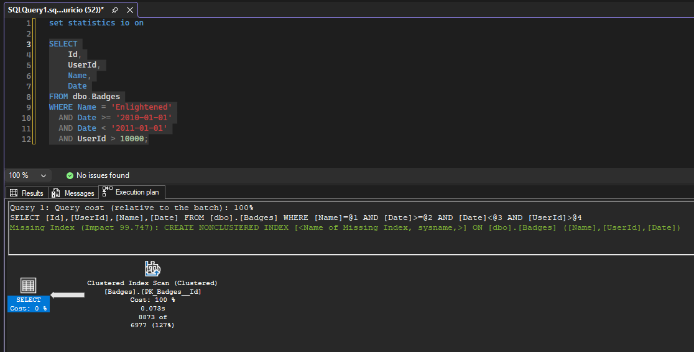

A imagem apresenta o **plano de execução utilizado na execução da consulta antes da criação do índice**.

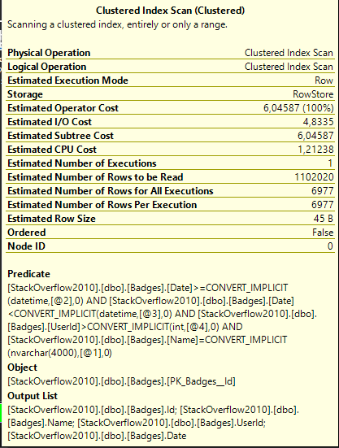

A imagem apresenta os **detalhes da execução estimada da consulta antes da criação do índice**.

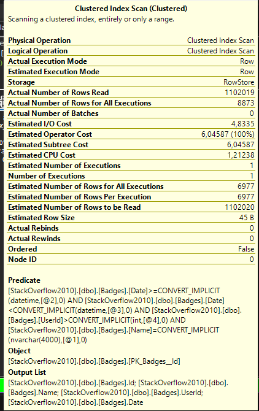

A imagem apresenta os **detalhes da execução real da consulta antes da criação do índice**.

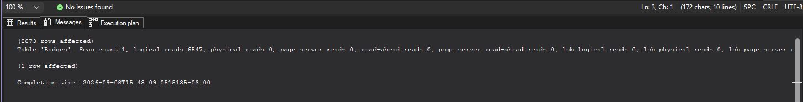

A imagem apresenta a **quantidade de páginas lidas pela consulta antes da criação do índice, totalizando 6.547 páginas**.

---

## Etapa 4 - Criação do índice

Depois da análise, criei um índice não clusterizado na tabela `dbo.Badges`.

O índice foi criado utilizando as colunas `Name`, `UserId` e `Date`, considerando a análise de seletividade realizada durante o exercício.

Defini `Name` como a primeira coluna do índice considerando a análise realizada.

As demais colunas utilizadas nos filtros também foram adicionadas ao índice para permitir que o SQL Server trabalhasse de forma mais eficiente com as condições da consulta.

O índice criado foi:

    CREATE NONCLUSTERED INDEX noclus_Badges_name
    ON dbo.Badges
    (
        Name,
        UserId,
        Date
    )
    WITH (FILLFACTOR = 90);
    GO

### Evidência

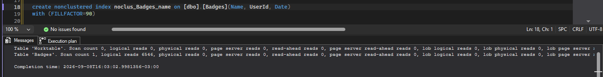

A imagem apresenta a **criação do índice não clusterizado `noclus_Badges_name` na tabela `dbo.Badges`**.

---

## Etapa 5 - Validação do novo índice

Depois da criação, validei novamente os índices existentes na tabela para confirmar que o novo índice havia sido criado corretamente.

Essa validação também me permitiu comparar a estrutura de índices existente antes e depois da alteração.

### Evidência

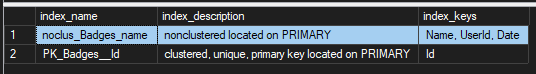

A imagem apresenta a **validação dos índices após a criação do novo índice `noclus_Badges_name`**.

---

## Etapa 6 - Nova execução após a criação do índice

Após criar o índice, executei novamente a mesma consulta para comparar os resultados.

Dessa vez, o plano de execução passou a utilizar um **Index Seek**.

A quantidade de páginas lidas caiu de **6.547 para 91 páginas**.

Isso representa uma redução de aproximadamente **98,6% na quantidade de páginas lidas pelo SQL Server**.

### Evidências

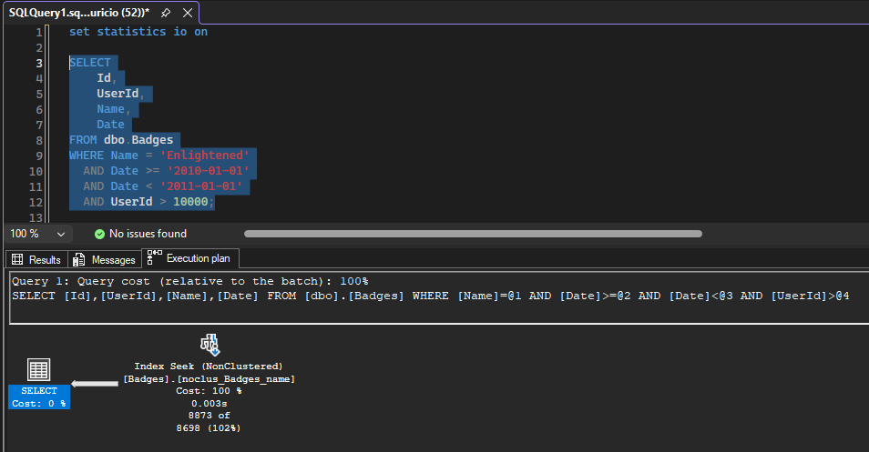

A imagem apresenta o **plano de execução após a criação do índice, demonstrando a utilização do Index Seek**.

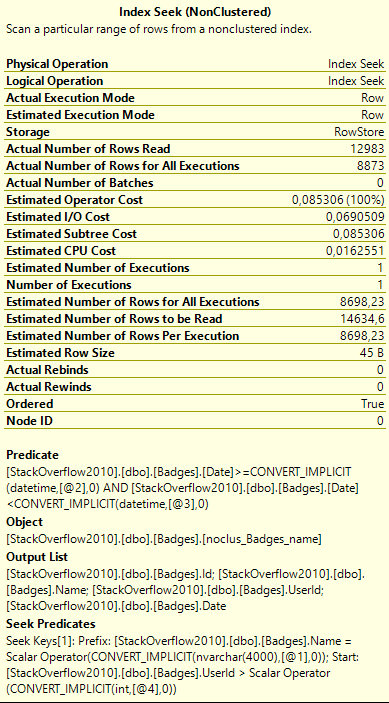

A imagem apresenta os **detalhes da execução da consulta após a criação do índice**.

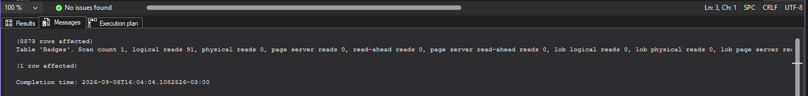

A imagem apresenta a **quantidade de páginas lidas após a criação do índice, totalizando 91 páginas**.

---

## Comparação dos resultados

| Métrica | Antes do índice | Após o índice |
|---|---:|---:|
| Plano de execução | Clustered Index Scan | Index Seek |
| Páginas lidas | 6.547 | 91 |
| Redução | — | Aproximadamente 98,6% |

A comparação mostrou uma diferença significativa no comportamento da consulta após a criação do índice.

A quantidade de páginas que precisaram ser lidas pelo SQL Server passou de **6.547 para apenas 91**.

Além da redução nas leituras, também observei a mudança do operador principal do plano de execução de **Clustered Index Scan** para **Index Seek**.

---

## Etapa 7 - Análise do resultado

Com essa prática, consegui observar na prática o impacto que um índice pode causar no desempenho de uma consulta.

Antes da criação do índice, o SQL Server utilizava um **Clustered Index Scan**, realizando a leitura de uma quantidade muito maior de páginas.

Depois da criação do índice, a consulta passou a utilizar um **Index Seek**, reduzindo significativamente a quantidade de páginas lidas.

Também pude perceber a importância de analisar os índices existentes e as condições utilizadas na consulta antes de criar um novo índice.

A análise não deve considerar apenas a quantidade de valores distintos de uma coluna, mas também o comportamento real dos filtros e a quantidade de registros que cada condição pode retornar.

---

## Conclusão

Neste laboratório, pratiquei **Performance & Tuning** com foco em **Index Tuning**, utilizando o banco `StackOverflow2010` e a tabela `dbo.Badges`.

Parti de um cenário em que a consulta realizava **6.547 páginas lidas** e apresentava um **Clustered Index Scan**.

Após analisar a consulta e criar o índice `noclus_Badges_name`, executei novamente a consulta e obtive **91 páginas lidas**, representando uma redução de aproximadamente **98,6%**.

O plano de execução também passou de **Clustered Index Scan** para **Index Seek**.

Esse exercício me ajudou a entender, de forma prática, como a criação e a escolha adequada de um índice podem contribuir para a otimização de consultas no SQL Server.
