# SQL Server DBA Lab

Laboratório prático de DBA utilizando SQL Server 2019 em ambiente Windows Server 2019 com Active Directory.

Este projeto tem como objetivo simular um ambiente corporativo para estudo e prática de administração de banco de dados com SQL Server.

---

## Tecnologias Utilizadas

| Tecnologia | Finalidade |
|---|---|
| Oracle VirtualBox | Virtualização do ambiente |
| Windows Server 2019 | Sistema operacional das VMs |
| Active Directory | Gerenciamento de domínio, usuários e contas de serviço |
| DNS Server | Resolução de nomes no ambiente de domínio |
| SQL Server 2019 | Sistema Gerenciador de Banco de Dados |
| SQL Server Management Studio | Administração da instância SQL Server |

---

## Arquitetura do Ambiente

O ambiente foi estruturado com duas máquinas virtuais principais:

```text
+-----------------------------+
| VM01 - DCSRV                |
| Windows Server 2019         |
| Active Directory            |
| DNS Server                  |
| Domain Controller           |
+-------------+---------------+
              |
              | Domínio: companyx.com
              |
+-------------v---------------+
| VM02 - DBSRV1               |
| Windows Server 2019         |
| SQL Server 2019             |
| SQL Server Management Studio|
+-----------------------------+

```

---

## Estrutura das Máquinas Virtuais

| VM | Nome do Servidor | Função |
|---|---|---|
| DCVM1 | DCSRV | Domain Controller |
| DBSRV1 | A definir/configurar | Servidor SQL Server |

---

## Domínio

O ambiente foi configurado com domínio próprio para simular uma estrutura corporativa.

| Item | Configuração |
|---|---|
| Domínio | companyx.com |
| Servidor Domain Controller | DCSRV |
| Sistema Operacional | Windows Server 2019 Datacenter Evaluation |
| Funções instaladas | Active Directory Domain Services e DNS |

> Por questões de segurança, endereços IP, senhas e demais informações sensíveis não são exibidos neste repositório.

---

## Organização dos Discos da VM SQL Server

A VM dedicada ao SQL Server foi configurada com discos separados para melhor organização dos arquivos do ambiente.

| Disco | Finalidade |
|---|---|
| Disco do Sistema | Instalação do Windows Server 2019 e arquivos do sistema operacional |
| Disco de Dados | Armazenamento dos arquivos de dados dos bancos de dados `.mdf` e `.ndf` |
| Disco de Logs | Armazenamento dos arquivos de log de transações `.ldf` |

Essa separação simula uma prática comum em ambientes SQL Server, permitindo melhor organização, manutenção e administração dos arquivos do banco de dados.

---

## Procedimentos Realizados

### 1. Infraestrutura Virtual

- Criada uma máquina virtual dedicada para atuar como Domain Controller.
- Criada uma máquina virtual dedicada para instalação do SQL Server.
- Configurados recursos de hardware virtual, como memória, disco, rede e armazenamento.
- Configurada rede entre as VMs para comunicação em ambiente de domínio.
- Configurados discos virtuais separados para sistema operacional, dados e logs do SQL Server.

---

### 2. Domain Controller

- Instalado o Windows Server 2019 na VM do Domain Controller.
- Configurado nome do servidor como `DCSRV`.
- Configurado endereço IP fixo.
- Instaladas as funções de Active Directory Domain Services e DNS.
- Promovido o servidor como Controlador de Domínio.
- Criado o domínio `companyx.com`.

---

### 3. Contas de Domínio para SQL Server

Foram criadas contas de domínio dedicadas para serviços e acessos relacionados ao SQL Server.

| Conta | Finalidade |
|---|---|
| SSMS | Conta de domínio para acesso administrativo ao SQL Server via SQL Server Management Studio |
| SSAS | Conta de serviço para o SQL Server Analysis Services |
| SSIS | Conta de serviço para o SQL Server Integration Services |
| SSRS | Conta de serviço para o SQL Server Reporting Services |

> Observação: o SSMS não é um serviço do SQL Server, mas sim a ferramenta gráfica utilizada para administração da instância. Neste laboratório, foi criada uma conta dedicada para acesso administrativo através do SSMS.

---

### 4. VM do SQL Server

- Criada uma VM dedicada para o servidor de banco de dados.
- Instalado o Windows Server 2019.
- Configurados discos separados para sistema operacional, dados e logs.
- Preparado o ambiente para ingresso no domínio e instalação do SQL Server 2019.

- ---

## Evidências

As evidências abaixo documentam as principais etapas realizadas na configuração inicial do laboratório.

| Etapa | Evidência |
|---|---|
| VM do Domain Controller criada no VirtualBox | 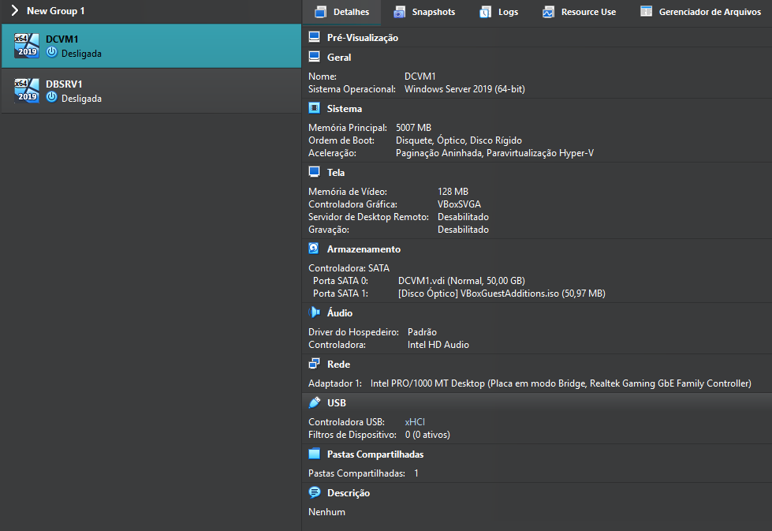 |
| VM do SQL Server criada no VirtualBox | 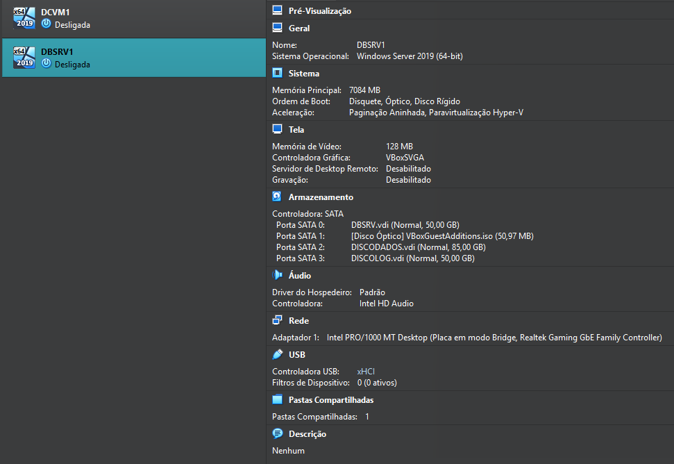 |
| Domain Controller configurado no domínio | 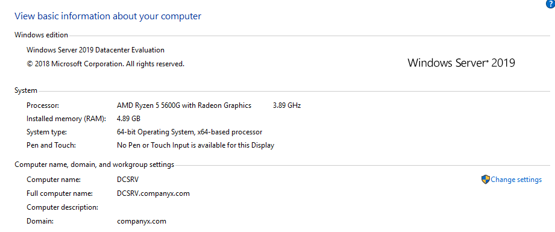 |
| Contas de domínio criadas para o ambiente SQL Server | 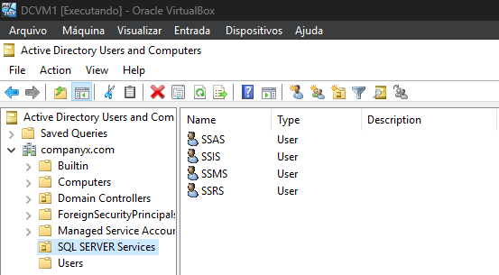 |

---

### 5. Instalação do SQL Server 2019

- Realizada a instalação do SQL Server 2019 na VM dedicada ao servidor de banco de dados.
- Configurado o SQL Server Database Engine durante o processo de instalação.
- Configurado o SQL Server Agent para inicialização automática.
- Configuradas contas de domínio para execução dos serviços do SQL Server.
- Alterada a collation do Database Engine para `SQL_Latin1_General_CP1_CI_AI`.
- Configurado o modo de autenticação do SQL Server.
- Configurado acesso administrativo à instância.
- Definidos diretórios separados para arquivos de dados e arquivos de log.
- Mantido o diretório de backup no mesmo disco da instalação para fins de prática em laboratório.
- Configurado o TempDB com múltiplos arquivos de dados, utilizando 6 arquivos conforme a quantidade máxima de núcleos disponíveis no ambiente.
- Instalado o SQL Server Management Studio.
- Validada a conexão com a instância SQL Server utilizando autenticação do Windows.

> Observação: o diretório de backup foi mantido no mesmo disco da instalação apenas para fins de estudo. Em ambientes produtivos, o ideal é utilizar um disco separado para backups ou uma solução externa, como armazenamento em nuvem.

---

## Evidências

As evidências abaixo documentam as principais etapas realizadas durante a instalação e configuração inicial do SQL Server 2019.

| Etapa | Evidência |
|---|---|
| Configuração das contas de serviço do SQL Server | 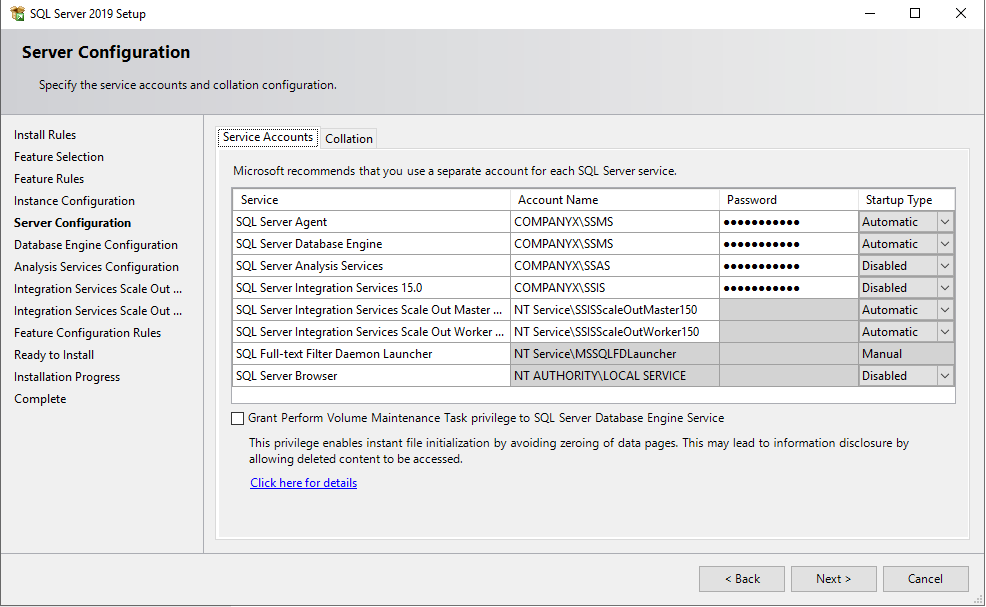 |
| Configuração da collation do Database Engine | 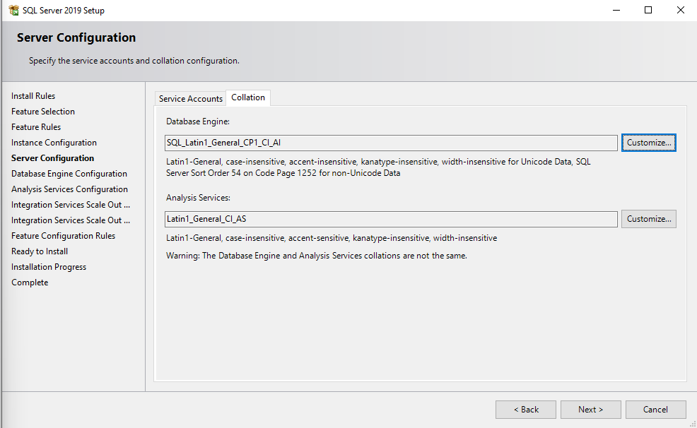 |
| Configuração de acesso à instância SQL Server | 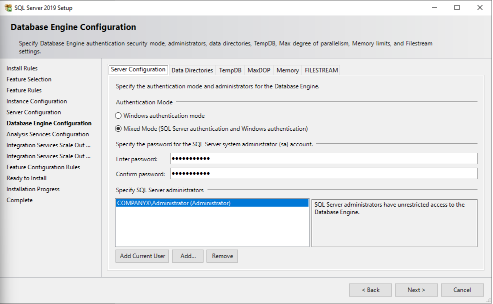 |
| Configuração dos diretórios de dados e logs | 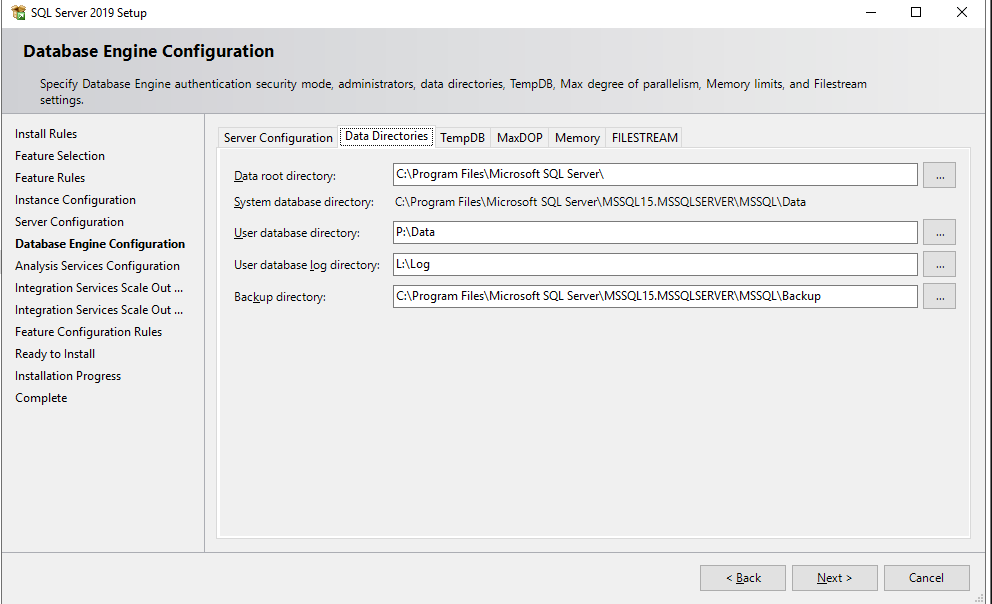 |
| Configuração do TempDB | 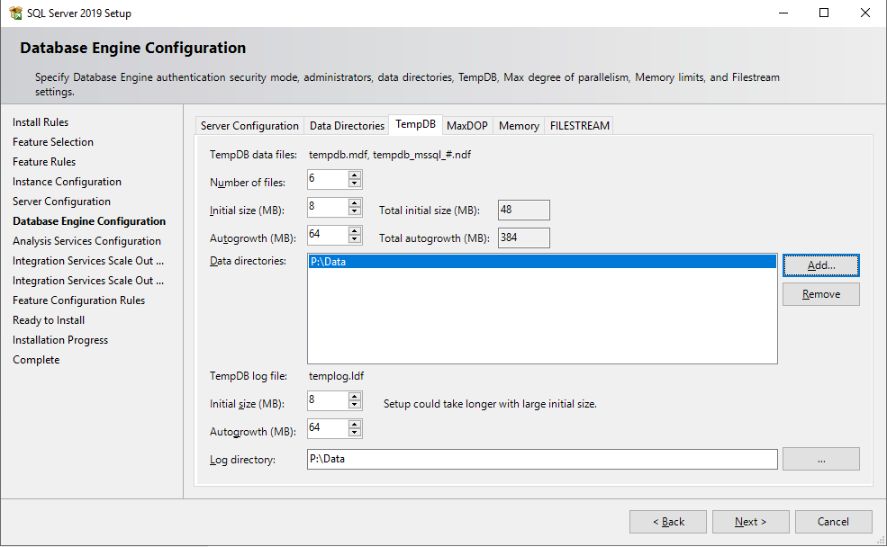 |
| Conexão ao SQL Server via SSMS com autenticação do Windows | 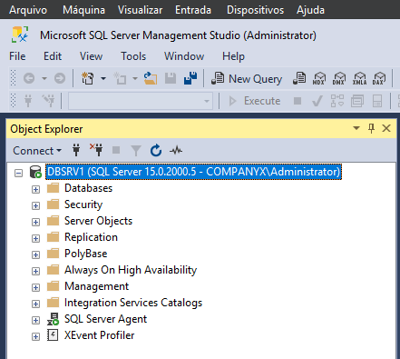 |

> Senhas, endereços IP e demais informações sensíveis foram omitidos ou mascarados por boas práticas de segurança.


---

### 6. Conceitos de Segurança no SQL Server

Nesta etapa estudei conceitos iniciais de segurança no SQL Server, incluindo modos de autenticação, nível de servidor, de banco de dados, permissões em objetos e utilização de schemas.

A segurança no SQL Server pode ser aplicada em diferentes níveis, permitindo controlar o acesso de usuários e grupos conforme a necessidade do ambiente. Esse controle pode ocorrer na instância, no banco de dados, nos objetos do banco ou por meio da organização lógica utilizando schemas.

---

#### Modos de Autenticação

O SQL Server permite dois principais modos de autenticação:

| Modo de Autenticação | Descrição |
|---|---|
| Windows Authentication | Utiliza usuários ou grupos do Windows/Active Directory para autenticação. O acesso é criado no Windows e vinculado ao SQL Server por meio de permissões. |
| SQL Server Authentication | Utiliza logins criados diretamente no SQL Server, como o usuário `sa` ou outros logins SQL. O acesso é gerenciado dentro da própria instância SQL Server. |
| Mixed Mode | Permite utilizar tanto autenticação do Windows quanto autenticação SQL Server. |

---

#### Segurança em Nível de Servidor

As roles em nível de servidor controlam permissões aplicadas à instância SQL Server como um todo.

| Role | Permissões |
|---|---|
| `sysadmin` | Realiza qualquer atividade no SQL Server. A permissão deste papel compreende as permissões de todos os outros papéis. |
| `securityadmin` | Gerencia os logins. Esta role pode inclusive conseguir se adicionar à role `sysadmin` ou adicionar outro usuário à role `sysadmin`. |
| `serveradmin` | Pode alterar configurações da instância e executar shutdown na instância. |
| `diskadmin` | Utilizada basicamente para criar e excluir dispositivos de backup. |
| `dbcreator` | Cria e altera bancos de dados. |
| `processadmin` | Tem permissão para executar `KILL` em processos da instância. |
| `setupadmin` | Tem permissão para gerenciar Linked Servers. |
| `bulkadmin` | Executa o comando `BULK INSERT`. |
| `public` | Todo login do SQL Server pertence à role `public`. Essa role permite conectar na instância, visualizar os bancos de dados da instância e executar instruções de `SELECT` no banco `master`. Deve ser utilizada com cuidado, pois permissões indevidas nessa role podem gerar riscos de segurança. |

---

#### Segurança em Nível de Banco de Dados

As roles em nível de banco de dados controlam permissões dentro de um banco específico.

| Role | Permissões |
|---|---|
| `db_owner` | Tem poderes totais sobre o banco de dados. |
| `db_accessadmin` | Pode adicionar e remover usuários no banco de dados. |
| `db_datareader` | Pode ler dados em todas as tabelas dos bancos de dados dos usuários. |
| `db_datawriter` | Pode adicionar, alterar ou excluir dados em todas as tabelas de usuário do banco de dados. |
| `db_ddladmin` | Pode adicionar, modificar ou excluir objetos do banco de dados, como tabelas, por exemplo. |
| `db_securityadmin` | Pode gerenciar roles e adicionar ou excluir usuários às roles do banco de dados. Também pode gerenciar permissões para objetos do banco de dados. |
| `db_backupoperator` | Pode realizar backup do banco de dados. |
| `db_denydatareader` | Não pode consultar dados em nenhuma das tabelas do banco de dados. |
| `db_denydatawriter` | Não pode alterar dados no banco de dados. |

---

#### Segurança em Nível de Objetos

A segurança em nível de objetos permite controlar permissões específicas em objetos do banco de dados, como:

- Tabelas;
- Views;
- Stored Procedures;
- Functions.

Os principais comandos utilizados para controle de permissões em objetos são:

| Privilégio | Descrição |
|---|---|
| `GRANT` | Atribui privilégios de acesso do usuário a objetos do banco de dados. |
| `REVOKE` | Remove os privilégios de acesso aos objetos obtidos com o comando `GRANT`. |
| `DENY` | Nega permissão a um usuário ou grupo para realizar operação em um objeto. |

---

#### Schemas no SQL Server

Schemas são coleções de objetos dentro de um banco de dados. Eles ajudam a organizar tabelas, views, procedures, functions e outros objetos de forma lógica.

Exemplo de organização por schema:

```sql
dbo.Clientes
financeiro.Pagamentos
rh.Funcionarios
```
---

## Evidências

As evidências abaixo documentam a criação do login `dbasql`, o vínculo com o banco `CLIENTES` e a validação por meio de views de sistema.

| Etapa | Evidência |
|---|---|
| Criação do login `dbasql` com autenticação SQL Server | 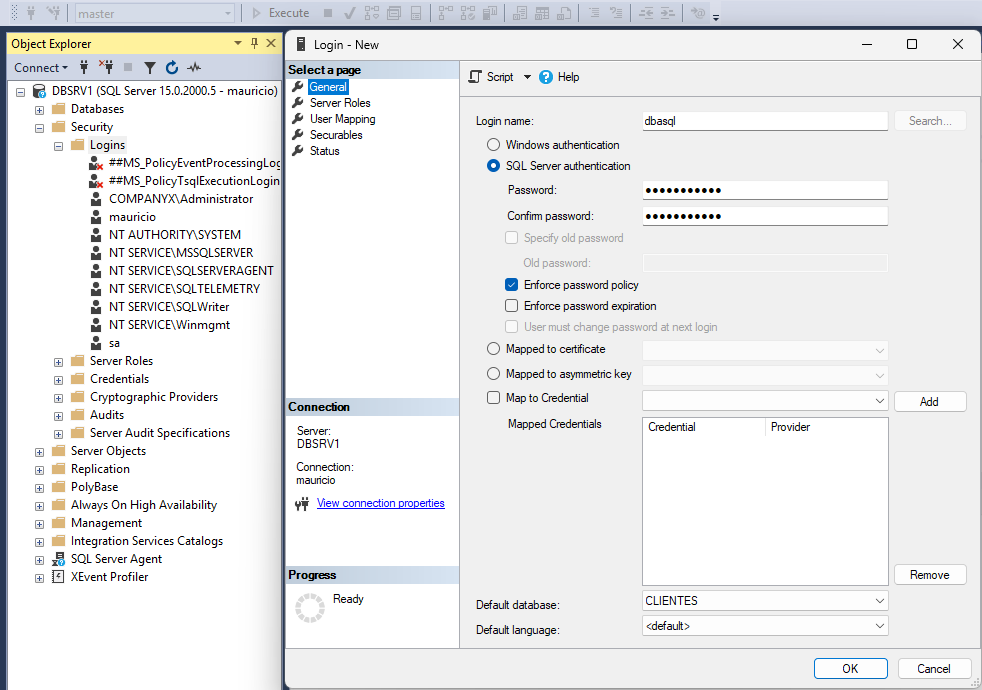 |
| Login `dbasql` criado na instância SQL Server | 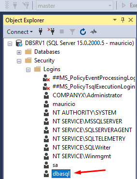 |
| Criação do user `dbasql` no banco CLIENTES | 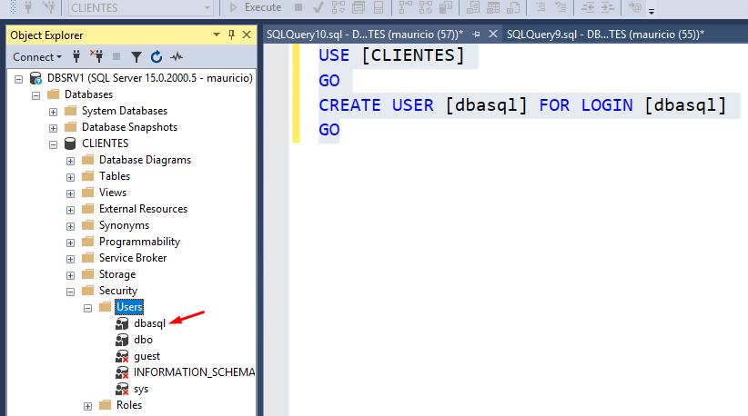 |
| Validação do login `dbasql` na instância | 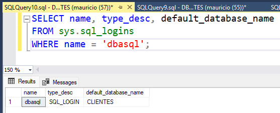 |
| Validação do user `dbasql` no banco CLIENTES | 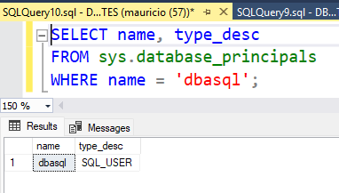 |

Nesta etapa foi validada a concessão de permissão mínima em nível de objeto. Inicialmente, o usuário `dbasql` não possuía permissão para consultar a tabela `dbo.Customer2`. Após a execução do comando `GRANT SELECT`, o acesso à tabela foi permitido.

| Etapa | Evidência |
|---|---|
| Teste de acesso à tabela `Customer2` antes da permissão | 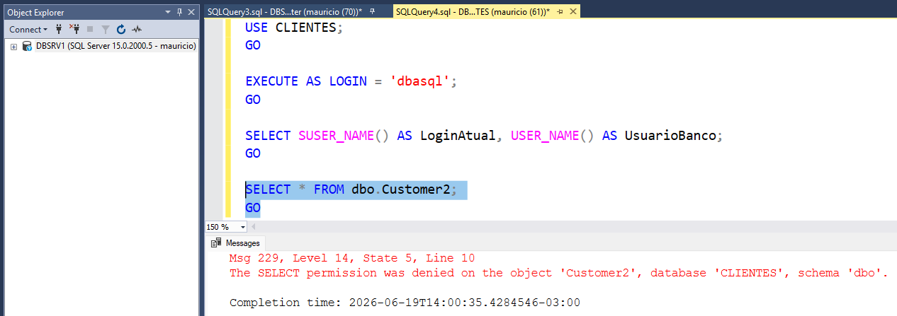 |
| Concessão da permissão `SELECT` na tabela `Customer2` para o user `dbasql` | 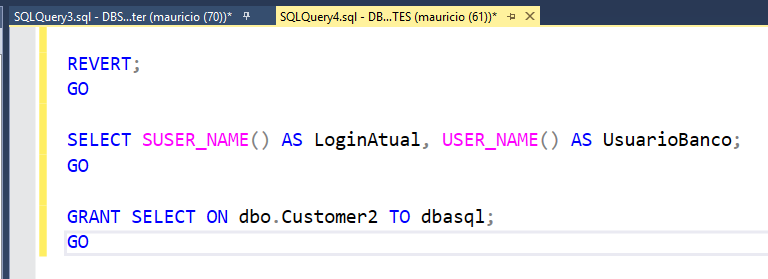 |
| Teste de acesso à tabela `Customer2` após a permissão | 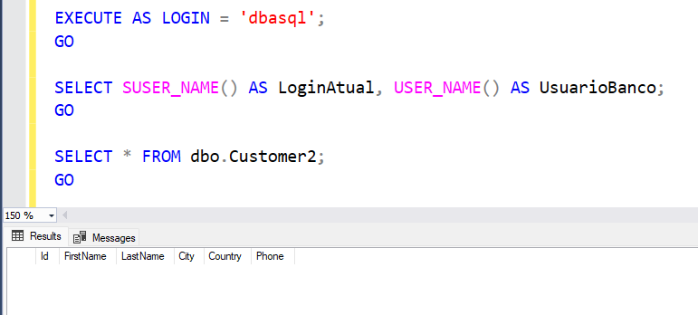 |
